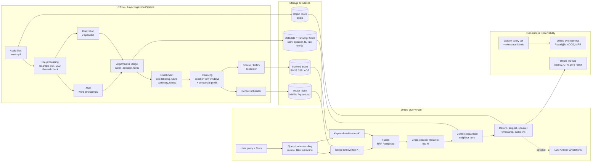

# AGENTS.md — Hybrid Retrieval over 2-Speaker Audio Transcripts

> The single source of truth for this project. Every discussion, option, decision and change gets written here.
> **Rules for any agent working here:**
> 1. Read this file before doing anything.
> 2. Never lock a decision on your own. Add options to §5 and wait for the user to pick one.
> 3. After each session, add an entry to §9 (Discussion Log) and update §6 (Decision Register).
> 4. **Every prompt:** record what was decided, **why**, and **why the other options were not chosen**.
> 5. **Two tracks:** §6 decisions are for the **time-boxed working prototype**. Production-grade choices are listed separately (the "Production alternative" in each §6 entry) and are decided later. Never mix them up.
> 6. Undecided items are locked **during development**, when they come up, by asking the user, never by assuming.

---

## 1. Problem Statement (verbatim)

**Effective retrieval from audio transcripts.** You have audio recordings of many conversations, each with two speakers. How might you achieve effective hybrid search (keyword + semantic) across them? What diarization, database, embedding and indexing strategies might give "ideal" retrieval quality at scale? What metrics matter if this system goes to production, and what would an effective evaluation of the system look like?

## 2. Problem Analysis

### 2.1 What is really being asked
| # | Sub-question | What it really tests |
|---|---|---|
| Q1 | Hybrid search across transcripts | Combining exact lexical matching (names, product codes, numbers) with semantic matching (paraphrase, intent) |
| Q2 | Diarization strategy | Knowing *who* said *what*, so queries like "what did the **customer** say about pricing" work |
| Q3 | Database, embedding and indexing strategy | Chunking of conversational text, choice of model, ANN index, sparse index, fusion, scale |
| Q4 | Production metrics | Quality, latency, cost, freshness and reliability, measured per stage |
| Q5 | Evaluation | A reproducible, stage-wise and end-to-end evaluation with a labeled set and ablations |

### 2.2 Key challenges specific to *audio transcripts* (unlike plain document RAG)
1. **Errors cascade.** ASR errors (WER) → diarization errors (DER) → wrong chunk text or wrong speaker → retrieval miss. Keyword search is hit hardest (a misspelled name gets 0 BM25 hits), so phonetic/fuzzy matching or semantic backup matters.
2. **Conversational text is sparse in meaning.** Turns like "yeah", "uh-huh" or "right, so…" carry little. Chunking must span several turns and keep speaker context.
3. **Meaning lives across turns.** A question is in turn *n* and its answer in turn *n+1*. Chunks that split Q/A pairs hurt recall.
4. **Speaker-aware retrieval.** You need a speaker/role label on every chunk, filterable at query time.
5. **Timestamps are the "citation".** A result must link back to `conversation_id + start_ms–end_ms`, so the user can play the audio.
6. **Scale.** Thousands to millions of hours means tens to hundreds of millions of chunks. ANN index, quantization, sharding and ingestion throughput all become real concerns.
7. **Two speakers is a gift.** If the audio is stereo/dual-channel (as in call centers), diarization becomes trivial and near-perfect through channel separation. That is worth checking first.

### 2.3 Assumptions (to confirm with user)
- A1: Language is English (multilingual changes model choices).
- A2: Audio may be mono (worst case, so diarization is needed) or stereo (channel split).
- A3: The hackathon deliverable is a working prototype, an eval report and a design for production scale.
- A4: Hardware is a Windows machine. **GPU availability is unknown** and affects ASR, diarization and embedding choices.

### 2.4 Confirmed facts / constraints (2026-09-26)
- **Scale:** 6 recordings, a few hundred chunks.
- **Time:** the build must fit in a short window (about one hour), so favor simplicity and defensibility.
- **Environment (checked):** Windows 10, Python 3.12.5. **No Docker, no Postgres/psql, no NVIDIA GPU.** ASR, diarization and embeddings run on CPU (fine for 6 recordings), or through an API.

---

## 3. High-Level Architecture

### 3.1 Component diagram


### 3.2 Ingestion flow (per recording)
1. **Load & normalize:** 16 kHz mono (or keep 2 channels if stereo), loudness normalization, VAD to drop silence.
2. **Channel check:** if stereo with one speaker per channel, diarize by channel. Otherwise run a diarization model with `num_speakers=2`.
3. **ASR:** transcribe with word-level timestamps.
4. **Merge:** give each word the speaker whose diarization segment overlaps it most. Group consecutive same-speaker words into **turns** `{speaker, start, end, text}`.
5. **Enrich (optional):** an LLM or classifier maps `SPEAKER_00/01 → role` (agent/customer, interviewer/guest), and extracts entities, topics and a conversation summary.
6. **Chunk:** a sliding window over turns (e.g. 3–6 turns, ~200–400 tokens, 1-turn overlap), each turn prefixed with its speaker label. Optionally prepend a *contextual header* (conversation title/summary) before embedding.
7. **Index:** a dense vector plus a sparse/BM25 representation plus metadata (`conv_id, chunk_id, speakers, roles, start_ms, end_ms, date, turn_ids`).

### 3.3 Query flow
1. Parse the query and extract structured filters (speaker/role, date, conversation).
2. Run **dense** and **keyword** retrieval in parallel, top-K each (K≈50–100), with the same filters.
3. **Fuse** the lists (RRF, k=60, as the baseline).
4. **Rerank** the fused top ~50 with a cross-encoder, keeping the top N (≈10).
5. **Expand** each hit with its neighboring turns for readability. Return snippet, speaker, timestamp and audio deep-link.
6. (Optional) generate an LLM answer with timestamp citations.

---

## 4. Solution Approaches (end-to-end), with pros and cons

### Approach A — "Postgres-only" (pgvector + BM25 extension)
Stack: WhisperX → Postgres (`pgvector` HNSW + `pg_search`/ParadeDB BM25, or built-in `tsvector`) → RRF in SQL → reranker.
- **Pros:** one database for metadata, transcripts, vectors and text. SQL joins and filters (speaker, date) are trivial. It is transactional, easy to demo and easy to reason about. It is good up to roughly 10–50M vectors on a single node.
- **Cons:** built-in `tsvector` is not true BM25 (it needs ParadeDB/pg_search for that). ANN scale-out is harder than in dedicated engines. Tuning HNSW together with filters (post-filter recall loss) takes care.

### Approach B — Search-engine native hybrid (OpenSearch / Elasticsearch)
Stack: WhisperX → OpenSearch (BM25 + k-NN field, hybrid query + normalization pipeline) → reranker.
- **Pros:** the best keyword features: analyzers, **phonetic** and fuzzy matching (helps with ASR errors), synonyms, phrase and proximity queries, highlighting. Hybrid search is built in. It scales out horizontally and is proven in production.
- **Cons:** heavy to run (JVM, cluster tuning). Vector search is slower and uses more memory than dedicated vector DBs. It is heavier to set up on a Windows laptop (Docker needed).

### Approach C — Vector-DB native hybrid (Qdrant / Weaviate / Milvus)
Stack: WhisperX → Qdrant with named vectors: dense plus sparse (BM25-style, SPLADE, or BGE-M3 sparse). Built-in fusion (RRF/DBSF), payload filters and quantization.
- **Pros:** very fast ANN, with scalar/binary quantization for scale and native sparse vectors. Hybrid search and fusion come in one query API. Payload filters do not hurt recall (filterable HNSW). It is simple to run in Docker, and multi-vector (ColBERT) support is available.
- **Cons:** "keyword" means sparse vectors, not a full-text engine: there are no rich analyzers, phrase queries or phonetic matching. Transcripts and metadata often need a second store. Exact-match edge cases (IDs, numbers) depend on the tokenizer.

### Approach D — Fully managed / API-first
Stack: Deepgram / AssemblyAI (ASR + diarization) → OpenAI / Cohere / Voyage embeddings → Pinecone / managed Elastic → Cohere Rerank.
- **Pros:** the fastest way to high quality with no GPU needed. Strong diarization and ASR out of the box, elastic scaling and minimal ops.
- **Cons:** cost per audio hour and per query, data privacy (recordings leave your infrastructure) and vendor lock-in. It shows less engineering depth, which matters for a hackathon judged on design. Model internals are harder to ablate.

### Approach E — Late-interaction / multi-vector (ColBERT, BGE-M3 multi-vector, ColBERT in Vespa)
Stack: WhisperX → BGE-M3 (dense + sparse + multi-vector) → Vespa or Qdrant multivector → BM25 + dense first stage, ColBERT MaxSim rerank.
- **Pros:** top retrieval quality. Token-level matching is robust to paraphrase and still sensitive to exact terms. Vespa handles hybrid ranking natively at huge scale.
- **Cons:** storage grows 10–100× (one vector per token) and indexing is more complex. Vespa has a steep learning curve. It is overkill for a first prototype.

### Approach F — LLM-enriched hierarchical index (a layer on top of A–E)
Add per-conversation summaries, per-chunk "contextual retrieval" headers, extracted entities/topics as filterable fields, and query rewriting/HyDE. Search at two levels: conversation first, then chunks inside it.
- **Pros:** large recall gains on vague or topic-level queries ("calls where the customer was angry about billing"). Entities make keyword search more precise. Supports faceted UX.
- **Cons:** LLM cost and latency at ingest time, possible hallucinated metadata, and more pieces to evaluate.

### 4.1 Comparison matrix (1 = poor, 5 = excellent)
| Criterion | A: Postgres | B: OpenSearch | C: Qdrant | D: Managed | E: ColBERT/Vespa | +F: LLM enrich |
|---|---|---|---|---|---|---|
| Retrieval quality | 3 | 4 | 4 | 4 | 5 | +1 |
| Keyword richness (phrase, fuzzy, phonetic) | 3 | 5 | 2 | 3–4 | 4 | +0 |
| Scale (100M+ chunks) | 2 | 4 | 4 | 5 | 5 | 0 |
| Ops simplicity | 5 | 2 | 4 | 5 | 1 | −1 |
| Hackathon build speed | 5 | 3 | 4 | 5 | 2 | −1 |
| Cost | 5 | 3 | 5 | 2 | 3 | −1 |
| Privacy / self-hosted | 5 | 5 | 5 | 1 | 5 | depends |

> **LOCKED (2026-09-26): Approach A — Postgres only.** See §6. The rest of §4 is kept as design rationale and as the "production at scale" migration story.
>
> **How A scales (for the defense):** at a few hundred chunks, an exact (brute-force) vector scan gives 100% recall in under 1 ms. Past ~1M chunks, add a pgvector HNSW index with halfvec/int8. Past ~10–50M chunks or at high QPS, either shard with Citus or move the retrieval tier to C (Qdrant) or B (OpenSearch), keeping Postgres as the system of record. The schema, chunking, fusion and eval harness all carry over unchanged.

### 4.2 Originally suggested approach (superseded by the user's lock on A)
**C (Qdrant hybrid) + reranker + a light touch of F**, with the evaluation harness treated as a first-class deliverable:

`WhisperX (faster-whisper large-v3 + pyannote 3.1, num_speakers=2, or channel split if stereo)` → `speaker-turn window chunks + contextual header` → `BGE-M3 (dense + sparse from ONE model)` or `dense model + BM25` → `Qdrant (dense HNSW + sparse, int8 quantization, payload filters on speaker/role/conv/date)` → `RRF` → `bge-reranker-v2-m3` → neighbor-turn expansion → results with timestamps.

**Reasoning:**
1. **Quality:** hybrid plus a cross-encoder reranker is the most consistent quality win in the retrieval literature (BEIR/MTEB-style results). Dense covers paraphrase, sparse covers names and numbers, and the reranker fixes the fusion ordering.
2. **Scale story:** Qdrant supports quantization, sharding, on-disk vectors and filterable HNSW. That gives a credible path from a laptop to 100M+ chunks without changing the design.
3. **Simplicity:** BGE-M3 produces dense and sparse vectors in one forward pass. That is one model for both retrieval arms, with no separate BM25 engine to run.
4. **Handles audio-specific problems:** speaker-turn chunking keeps Q/A pairs together, speaker/role payloads allow speaker-scoped queries, and timestamps give playable citations.
5. **Evaluability:** each stage (ASR, diarization, dense, sparse, fusion, rerank) is swappable, so ablations are easy. That directly answers the "effective evaluation" part of the problem.
6. **Known weakness and mitigation:** no phonetic/fuzzy keyword search. Mitigate with an ASR custom vocabulary / initial prompt, or add Approach B's phonetic analyzer later if the eval shows keyword misses on names.

**Runner-up:** A (Postgres + ParadeDB). Pick it if simplicity and one database matter more than the scale story.

---

## 5. Open Decisions (options for the user to lock)

> Format: options; ⭐ = suggested default. **Nothing here is locked until it appears in §6.**
>
> **Status (2026-09-26):** Locked for the prototype: D1, D2, D3, D4, D5, D6, D7, D7.1, D7.2, D7.3, D8, D12, D13. Still open: D9 (moot for the prototype because of D7.3), D10, D11, plus the new sub-decisions in §6.2.

### D1. Input data source
- (a) Public 2-speaker corpus (e.g. CALLHOME/Switchboard-style telephone speech; check licensing, since LDC corpora are paid)
- (b) ⭐ **Synthetic conversations:** an LLM writes scripts and TTS gives two distinct voices. Ground truth for transcript, speaker and relevance comes *for free*, which is ideal for evaluation.
- (c) Public podcasts/interviews (realistic, but no ground truth)
- (d) Mix: (b) for eval ground truth + (c) for realism

### D2. ASR engine
- (a) ⭐ **WhisperX** (faster-whisper large-v3 + wav2vec2 word alignment). Good accuracy and precise word timestamps. GPU preferred.
- (b) faster-whisper alone (simpler, but less accurate word timestamps)
- (c) NVIDIA Parakeet/Canary (NeMo): very fast and accurate, but a heavier install on Windows
- (d) API: Deepgram / AssemblyAI (diarization included)

### D3. Diarization
- (a) **Channel split**, if the audio is stereo (near-perfect and free)
- (b) ⭐ **pyannote speaker-diarization-3.1** with `num_speakers=2` (the open-source standard)
- (c) NVIDIA NeMo (MSDD / Sortformer)
- (d) Bundled with the API choice in D2(d)
- Add-on: LLM **role labeling** (SPEAKER_00 → agent/customer), yes or no?

### D4. Chunking strategy
- (a) One chunk per utterance/turn (precise, but too little context)
- (b) ⭐ **Speaker-turn sliding window** (3–6 turns / ~300 tokens, 1-turn overlap), speaker labels inline
- (c) Q/A pair chunks (question turn + answer turn)
- (d) Semantic/topic segmentation (split at embedding-similarity drops)
- Add-on: **parent–child** (retrieve small chunks, return the larger window), yes or no?
- Add-on: **contextual header** (conversation summary prepended before embedding), yes or no?

### D5. Dense embedding model
- (a) ⭐ **BGE-M3** (open source, dense + sparse + multi-vector, 8k context, multilingual)
- (b) Qwen3-Embedding (0.6B / 4B): top of MTEB, open source
- (c) OpenAI text-embedding-3-large / Cohere embed-v4 / Voyage (API)
- (d) Small/fast: bge-small / nomic-embed / e5-small (CPU-friendly)

### D6. Keyword / sparse representation
- (a) Classic **BM25** (Lucene/tantivy/pg_search/Qdrant BM25 sparse)
- (b) ⭐ **BGE-M3 sparse** (learned lexical weights from the same model as D5a)
- (c) SPLADE v3 (strong learned sparse, extra model)
- Add-on: fuzzy/phonetic matching for ASR-misspelled names (needs B-style engine), yes or no?

### D7. Database / index — ✅ LOCKED: (a) Postgres (see §6)
- (a) **Postgres + pgvector + full-text search** ← LOCKED
- (b) OpenSearch / Elasticsearch
- (c) ⭐ **Qdrant** (dense + sparse named vectors, payload filters, quantization)
- (d) Weaviate / Milvus
- (e) Vespa (+ ColBERT)
- (f) LanceDB (embedded, zero-server, good for a laptop demo)

### D7.1 How to run Postgres (new; no Docker/Postgres installed)
- (a) ⭐ **`pgserver` (pip)**: embedded Postgres with pgvector bundled, started from Python with no admin rights and no installer. *Verify that the Windows wheel installs on Py 3.12 before locking.*
- (b) **Managed Postgres free tier** (Supabase / Neon): pgvector included, zero install, but needs internet and signup, and the data leaves the machine.
- (c) Native Windows Postgres installer (EDB) + **compile pgvector** with VS Build Tools (`nmake`): slow and fragile, risky in a one-hour window.
- (d) Install Docker Desktop + ParadeDB image: true BM25, but needs WSL2 and a reboot, which is too slow for this window.

### D7.2 Lexical (keyword) ranking inside Postgres
- (a) ⭐ **Built-in `tsvector` + GIN index + `ts_rank_cd`**: zero extensions, supports phrase (`<->`) and prefix queries. Not true BM25 (no IDF saturation), which is acceptable at a few hundred chunks.
- (b) ParadeDB `pg_search` (real BM25): only realistic with D7.1(d).
- (c) Hybrid: `tsvector` for candidate filtering, BM25 scores computed in Python (`rank_bm25`) over candidates.
- Add-on: `pg_trgm` trigram similarity for fuzzy matching of names ASR misspelled (ships with Postgres contrib), yes or no?

### D7.3 Vector index
- (a) ⭐ **No ANN index: exact scan** (`ORDER BY embedding <=> q`), which gives 100% recall and is instant at this scale. The HNSW DDL is documented as the scale path.
- (b) pgvector HNSW index anyway (to demo the production config; approximate recall is irrelevant at this size)

### D8. Fusion + reranking
- Fusion: (a) ⭐ **RRF** (k=60) · (b) weighted score fusion (min-max / z-score normalized, α tuned on dev set) · (c) Qdrant DBSF
- Reranker: (a) ⭐ **bge-reranker-v2-m3** (open) · (b) Cohere Rerank 3.5 (API) · (c) LLM-as-reranker (listwise) · (d) none (baseline)

### D9. ANN index and scale settings
- (a) ⭐ HNSW (m=16–32, ef_construct=100–200) + **int8 scalar quantization** with rescoring
- (b) HNSW + binary quantization (32× smaller; needs oversampling and rescoring)
- (c) IVF-PQ / DiskANN (billion scale, on disk)

### D10. Query understanding
- (a) ⭐ Rule/LLM filter extraction (speaker/role, date) + raw query
- (b) + query rewriting / multi-query expansion
- (c) + HyDE (hypothetical answer embedding)
- (d) None (plain query)

### D11. Output layer
- (a) Search results only (snippet + speaker + timestamp + audio player)
- (b) ⭐ Search results + optional LLM answer with timestamp citations (RAG)

### D12. App / serving stack
- Backend: (a) ⭐ Python FastAPI · (b) Python scripts + notebook only
- UI: (a) ⭐ Streamlit / Gradio (fast) · (b) Next.js/React (polished) · (c) CLI only

### D13. Compute
- (a) Local GPU (which one? how much VRAM?)
- (b) CPU-only local (use smaller models / API ASR)
- (c) Cloud GPU (Colab/Kaggle/RunPod) for batch ingestion, local for serving

---

## 6. Decision Register (LOCKED decisions only)

> **Scope: time-boxed working PROTOTYPE** (6 recordings, a few hundred chunks, CPU-only, about a one-hour build).
> The production track is listed per decision as "Production alternative". Those are **not locked**.

### 6.1 Locked decisions

**L1 — Overall approach: Approach A (Postgres only)** · 2026-09-26
- **Why:** one transactional DB handles metadata, lexical full-text search and vector search. At 6 recordings and a few hundred chunks, the system stays simple, fully understandable, fast to build and defensible in the time window, with zero infrastructure risk.
- **Why not the others:** B (OpenSearch) is heavy JVM ops for no gain at this scale. C (Qdrant) needs a second store for metadata and has weaker keyword search. D (managed APIs) costs money, sends data out, and shows less engineering. E (ColBERT/Vespa) is overkill with a steep learning curve. F (LLM enrichment) adds cost, latency and new failure modes.
- **Production alternative:** Postgres stays the system of record. Add HNSW at 1M+ chunks. Move retrieval to Qdrant/OpenSearch (or shard with Citus) at 10–50M+ chunks or at high QPS.

**L2 — D7: Postgres + pgvector + Postgres full-text search** · 2026-09-26
- **Why:** follows from L1.
- **Why not the others:** see L1.

**L3 — D1: Data = (b) synthetic: LLM-written scripts + TTS** · 2026-09-26
- **Why:** ground truth comes for free: exact transcript, speaker per turn, and which turn holds which fact. That enables real WER/DER and retrieval metrics without hand labeling. Fully controllable (topics, names, numbers for keyword tests) and no licensing issues.
- **Why not the others:** (a) public corpora (CALLHOME/Switchboard) are LDC-licensed/paid and slow to obtain. (c) podcasts have no ground truth, so no measurable evaluation. (d) mix: no time for it.
- **Known trade-off:** TTS audio is cleaner than real calls (no overlap, noise or accents), so WER/DER will be optimistic. State this in the report.
- **Production alternative:** real recordings plus a hand-corrected, labeled subset as the golden set.

**L4 — D2: ASR = (b) faster-whisper alone** · 2026-09-26
- **Why:** CTranslate2 int8 runs well on CPU, pip-installs cleanly on Windows, and gives segment timestamps (and word timestamps if needed). Accurate enough on clean TTS audio.
- **Why not the others:** (a) WhisperX adds a wav2vec2 alignment model and a heavier dependency tree, and its benefit (precise word timing) matters little when chunks are turn-level. (c) NeMo Parakeet/Canary is a painful install on Windows and GPU-oriented. (d) APIs (Deepgram/AssemblyAI) cost money and send data out.
- **Production alternative:** WhisperX or Parakeet on GPU, or a managed ASR API. Add custom vocabulary / initial prompt for domain names.

**L5 — D3: Diarization = Resemblyzer speaker embeddings + KMeans (k=2)** · 2026-09-26
- **Why:** no model-access tokens or accounts. Lightweight and CPU-friendly. With exactly two speakers, k=2 clustering of per-segment voice embeddings is simple, explainable and works on distinct TTS voices.
- **Why not the others:** pyannote was **rejected because of auth overhead** (Hugging Face gated model, accept terms, token). NeMo is a heavy install. The API option conflicts with self-hosting and cost. Channel split doesn't apply, because synthetic audio will be mixed mono.
- **Design note:** run faster-whisper first → Resemblyzer embedding per ASR segment → KMeans(k=2) → label segments SPEAKER_A/B. Segments that contain a speaker change can be mislabeled, which is acceptable on TTS audio with clean turn boundaries.
- **Production alternative:** pyannote 3.1 / NeMo Sortformer (handles overlap and speaker changes inside a segment), or channel split for stereo call audio.

**L6 — D4: Chunking = speaker-turn chunks (merge consecutive same-speaker segments, gap ≤ 1 s, max 30 s)** · 2026-09-26
- **Why:** a chunk is one natural speaker turn, so attribution is unambiguous (every chunk has exactly one speaker, which makes speaker filtering exact). The ≤ 1 s gap merges fragments of one turn, and the 30 s cap keeps chunks within the embedding model's input limit (MiniLM ~256 tokens ≈ 30 s of speech).
- **Why not the others:** (a) per-utterance is too fragmented for semantic embedding. (c) Q/A pairs mix two speakers in one chunk. (d) topic segmentation is more complex and fragile on a few hundred chunks.
- **Known trade-off:** a question and its answer land in different chunks. Mitigate at display time by returning neighboring turns.
- **Production alternative:** multi-turn sliding windows / parent–child chunks with a contextual header.

**L7 — D5: Embeddings = (d) small/fast MiniLM (sentence-transformers)** · 2026-09-26
- **Why:** 384 dimensions, ~80 MB, fast on CPU, one-line install, and good enough for a few hundred chunks.
- **Why not the others:** (a) BGE-M3 (~2.2 GB) and (b) Qwen3-Embedding are slow on CPU and heavy to download. (c) API models cost money and need keys and network access.
- **Production alternative:** BGE-M3 / Qwen3-Embedding / an API model, chosen by eval on real data.

**L8 — D6: Keyword = (a) classic lexical via Postgres `tsvector`** · 2026-09-26
- **Why:** built into Postgres (in line with L1), with no extra model or extension.
- **Why not the others:** (b) BGE-M3 sparse and (c) SPLADE need an extra heavy model and a sparse-vector store, which conflicts with L1 and L7.
- **Production alternative:** true BM25 (ParadeDB pg_search / OpenSearch) and/or learned sparse (SPLADE). Add `pg_trgm`/phonetic matching for ASR-misspelled names.

**L9 — D7.1: Postgres hosting = Docker, plain `pgvector/pgvector` image (no ParadeDB)** · 2026-09-26
- **Why:** a reproducible one-command setup, pgvector preinstalled, and the same image works everywhere.
- **Why not the others:** `pgserver` is less standard and Windows support is unverified. A managed free tier (Supabase/Neon) needs signup and sends data out. A native install needs pgvector compiled on Windows. ParadeDB is not needed, because of L8/L10.
- ⚠️ **Setup risk:** Docker is **not installed** on this machine (checked 2026-09-26). It needs Docker Desktop + WSL2 (possibly a reboot). Do this **before** the timed window.
- **Production alternative:** managed Postgres (RDS / Cloud SQL / Supabase) with pgvector.

**L10 — D7.2: Lexical ranking = `tsvector` + GIN index + `ts_rank_cd`** · 2026-09-26
- **Why:** zero extensions, supports phrase and prefix queries, and the GIN index is standard.
- **Why not the others:** (b) pg_search needs ParadeDB (rejected in L9). (c) Python-side BM25 splits ranking across two places.
- **Known trade-off:** `ts_rank_cd` is not BM25 (no IDF or length saturation), which is acceptable at this scale. Fusion (L12) uses **ranks, not scores**, so score calibration doesn't matter.
- **Production alternative:** true BM25.

**L11 — D7.3: Vector index = none (exact scan)** · 2026-09-26
- **Why:** at a few hundred chunks a brute-force `ORDER BY embedding <=> q` takes under a millisecond and gives **100% recall**, so there is nothing to tune.
- **Why not the others:** an HNSW index gives approximate recall and tuning work for no benefit at this size.
- **Production alternative:** pgvector HNSW (m=16, ef_construction=64–200, halfvec/int8) above ~100k–1M chunks.

**L12 — D8: Fusion = (a) RRF (k=60); reranker = (d) none** · 2026-09-26
- **Why:** RRF is parameter-free, needs no score normalization (important because `ts_rank_cd` and cosine scores are on different scales), is a standard strong baseline, and can be written in one SQL CTE or a few lines of Python.
- **Why not the others:** weighted fusion needs a tuned α and normalization, and there's no dev set yet. DBSF is Qdrant-specific. Rerankers (bge-reranker, Cohere, LLM) are slow on CPU or cost money, and the time box doesn't allow them.
- **Production alternative:** a cross-encoder reranker (bge-reranker-v2-m3 / Cohere Rerank) over the fused top 50, and α tuned on the golden set.

**L13 — D12: Backend = FastAPI; UI = Streamlit/Gradio** · 2026-09-26
- **Why:** all Python, so there's no context switch. FastAPI gives a clean `/search` API with automatic docs. Streamlit/Gradio gives a UI (with audio playback) in about 50 lines.
- **Why not the others:** scripts or a notebook alone isn't a demoable product. Next.js/React takes too long for the time box. A CLI alone is a weaker demo.
- **Sub-choice still open:** Streamlit vs Gradio (decide during development).
- **Production alternative:** FastAPI behind a gateway, with a React/Next.js frontend.

**L14 — D13: Compute = (b) CPU-only local** · 2026-09-26
- **Why:** matches the actual hardware (no NVIDIA GPU, checked). Six short recordings are cheap to process on CPU.
- **Why not the others:** a local GPU doesn't exist. Cloud GPU adds setup and data transfer overhead for no gain at this scale.
- **Consequence:** use smaller faster-whisper models (e.g. `small`/`base`, int8).
- **Production alternative:** GPU batch workers for ingestion, CPU for query serving.

**L15 — O5: UI = Streamlit** · 2026-09-26
- **Why:** page-style layout suits a search box plus a result list, and `st.audio(..., start_time=)` jumps playback to a result's timestamp. Simplest option for this UI.
- **Why not Gradio:** built around demo components; laying out a ranked list of results is less flexible.
- **Production alternative:** React/Next.js frontend (see L13).

**L16 — O2: No TTS package; the user supplies the 6 recordings** · 2026-09-26
- **Why:** the user will paste the audio files into `data/audio/`, so there's nothing to generate.
- **Why not edge-tts / pyttsx3:** unnecessary dependencies.
- **Note:** L3 ground truth (exact transcript, speaker per turn) is only available if the user also provides the scripts used to make the audio. Ask when evaluation starts.

**L17 — Python environment: global Python 3.12 (no venv)** · 2026-09-26
- **Why:** user's choice. Simplest option, with no activation step.
- **Why not a project `.venv`:** the user preferred global. Trade-off: possible version conflicts with other projects on this machine. `requirements.txt` keeps the setup reproducible.
- **Production alternative:** a pinned venv/lockfile, or a container image.

**L18 — Build strategy: S4 (pipeline order with file checkpoints, plus an early database smoke test once Docker is up)** · 2026-09-26
- **Order:** C1 ASR → C2 diarization → C3 turn merge/chunks → C4 embeddings → C5 database schema + load → C6 search (lexical, vector, RRF) → C7 API → C8 UI → C9 eval. Insert the database smoke test as soon as Docker runs. Build one small component at a time.
- **Why:** ASR is the slowest step and feeds everything else, and it's the only step not blocked right now. Caching each stage's output avoids re-running slow steps. The early smoke test catches Docker/pgvector problems early.
- **Why not the others:** S1 surfaces database problems late. S2 and S3 need Docker immediately (blocked). S3's fake data hides ASR and diarization problems, which are the main risk.

**L19 — O3 procedure: benchmark `base` vs `small` on ONE recording, then the user picks the size for all 6** · 2026-09-26
- **Why:** CPU speed on this machine is unknown, so the choice should rest on measured time and quality, not a guess.
- **Why not pick directly:** `small` blind could be too slow; `base` blind could miss names and numbers.

**L20 — Intermediate outputs: JSON files under `data/processed/<stage>/`** · 2026-09-26
- **Why:** easy to inspect and diff. Later stages re-run without redoing ASR. Not blocked on Docker.
- **Why not straight into Postgres:** blocked until Docker works, and harder to inspect while iterating.

**L21 — No ground-truth scripts for the 6 recordings** · 2026-09-26
- **Consequence:** WER/DER can't be computed automatically. Eval (C9) will use hand-checked samples plus LLM-generated queries with manual relevance labels. L3's "free ground truth" benefit does not apply.

**L22 — O3: Whisper model = `small` (int8, CPU)** · 2026-09-26
- **Why:** the benchmark on rec01 showed `small` fixes keyword-critical terms ("on-call", "lint", "write-up", "2.20") that `base` gets wrong, and keyword search (L8) can't recover from misspelled tokens. It's a one-time cost of ~40 min, cached to JSON (L20).
- **Why not `base`:** ~2.9× faster, but it misspells domain terms, so keyword queries return nothing for them.

**L23 — Schema decisions (O11–O19)** · 2026-09-26
| ID | Choice | Why | Why not the alternative |
|---|---|---|---|
| O11 | **2 tables:** `recordings` + `chunks` | Recording-level fields (hash, status, duration) are stored once; chunks reference them | A flat table repeats recording fields on every chunk and has nowhere natural for status |
| O12 | **`english` text-search config** | Stemming ("refunds" ↔ "refund") and stopword removal help conversational queries | `simple` is exact-only, so recall drops on word variants; two columns are over-engineering for now |
| O13 | **Raw speaker label only (`A`/`B`)** | Comes straight from diarization, with no extra model | `role` needs LLM role labeling, which isn't in scope |
| O14 | **No segment table; chunks only** | Raw ASR segments already live in JSON (L20) | A DB copy is duplication with no query use |
| O15 | **Status: `processing` / `completed` / `failed`** | Ingestion is synchronous, so there is no queued state | `pending` only matters with an async queue |
| O16 | **`error TEXT`** | Records why a recording failed | Without it a `failed` row isn't debuggable |
| O17 | **`created_at` / `updated_at`** (default `now()`; ingest code sets `updated_at` on every status change) | Shows timing and spots stuck `processing` rows | A trigger is extra machinery for a single writer |
| O18 | **Re-ingest rule by `content_sha256`:** completed → skip, failed → retry, processing → skip | Idempotent: the same audio is never processed twice, and failures are recoverable | "Always reprocess" wastes ASR time and churns rows |
| O19 | **`id` = file stem; `content_sha256` UNIQUE** | Readable IDs in results and logs; the hash still guarantees idempotency | A hash as the ID is unreadable in the UI, logs and joins |

- **Production alternative:** `pending` state plus a job queue, a status history table, and `processing` rows with a lease/timeout so a crashed worker's rows get retried.

**L24 — Ingestion error-handling rules (user-specified)** · 2026-09-26
1. **Truncate `error` text to 2000 chars** in the ingestion code before saving. **Why:** full stack traces would bloat the DB. **Why app-level, not a DB CHECK:** a CHECK would *reject* the write and lose the failure record, whereas truncation keeps it. *To implement in C5 (ingest code doesn't exist yet).*
2. **Same file while `processing` → skip** (restates the O18 rule in L23). **Why it's safe:** ingestion runs **sequentially, not concurrently**, so no two runs race on the same hash.
3. **A recording stuck in `processing` (crash mid-run) is NOT auto-recovered.** Documented as a known limitation (§6.3). Don't build auto-retry.
4. `updated_at` already existed (added with O17 in L23). Stuck rows are visible by age (see §6.3).

### 6.3 Known limitations (prototype)
| # | Limitation | Impact | Manual workaround | Production fix |
|---|---|---|---|---|
| K1 | A crash mid-ingest leaves the recording in `processing` forever. The O18 rule skips it, so it's never retried. | That recording stays unsearchable until someone intervenes | Find it: `SELECT id, updated_at FROM recordings WHERE status='processing' AND updated_at < now() - interval '30 minutes';` Then `DELETE` the row (chunks cascade) or set `status='failed'` and re-run ingestion. | Lease/heartbeat column + timeout → auto-mark `failed` → retry, or a job queue with visibility timeouts |
| K2 | Skipping on `processing` assumes **sequential** ingestion | Concurrent workers could race on the same hash (the UNIQUE constraint would reject the second insert, but not cleanly) | Don't run ingestion in parallel | `INSERT … ON CONFLICT` + `SELECT … FOR UPDATE SKIP LOCKED` job claiming |

**L25 — Project structure: layered packages inside `app/` (pipeline / db / search / api / ui), clearer stub names, and a README** · 2026-09-26
- **Why:** the folders follow the system flow (offline pipeline → DB → online search → API → UI), so anyone can find things. `config.py` stays at `app/config.py`, so there are **zero code changes** (all imports are `from app.config`).
- **Why not a `src/` layout:** an extra nesting level, only useful for installable packages. **Why not top-level folders without `app/`:** generic names (`db`, `search`) can collide with installed libraries.
- **Renames:** `db.py→db/connection.py`, `search.py→search/hybrid.py`, `api.py→api/main.py`, `ui.py→ui/streamlit_app.py`. Stage files for C3/C4/C9 are created only when built (no empty placeholders).

**L26 — O4: embed with BOTH `all-MiniLM-L6-v2` and `multi-qa-MiniLM-L6-cos-v1`; pick the winner by evaluation** · 2026-09-26
- **Why:** an empirical choice beats a guess. Both are 384-dim and ~1 s per recording on CPU, so running both costs almost nothing. Vectors are kept apart: `data/processed/embeddings/<model>/<rec>.npz` (`vectors`, `chunk_index`), L2-normalized so pgvector cosine (`<=>`) is correct.
- **Why not pick one now:** general vs question→passage training is exactly the kind of thing the C9 eval should decide.

**L27 — Logging in all code (user request)** · 2026-09-26
- **What:** `app/log.py` → `get_logger(name)` (stdlib `logging`). Every `app.*` logger writes to **console + `logs/app.log`** (on D, gitignored, rotating 5 MB × 3). Format: `time LEVEL [module] message`. Each per-recording step is wrapped in `try/except → log.exception(...recording...) → raise`, so a failure records **which recording** and the **full traceback**, while behavior stays the same (the run still stops on the first error). `print`s were replaced by `log.info`. The DB URL is never logged (it contains the password).
- **Why stdlib logging:** zero dependencies and standard. **Why not structlog/loguru:** an extra dependency for no gain at this size.
- **Verified:** re-running chunking produced byte-identical outputs; the log file is written.
- **Production alternative:** JSON logs → a central log store (Loki/ELK/CloudWatch), with a request/recording ID for correlation.

**L28 — Embedding model = `all-MiniLM-L6-v2` (supersedes L26)** · 2026-09-26
- **Why:** it won the rec01 comparison on all three metrics (Hit@1 0.29 vs 0.21, Hit@3 0.57 vs 0.43, MRR 0.441 vs 0.399), and it was already cached. The single DB column `embedding VECTOR(384)` is unchanged. Set as `EMBED_MODEL` in config.
- **Why not `multi-qa-MiniLM-L6-cos-v1`:** lower on every aggregate metric here, despite winning 5 individual queries. The margin is small, so it's worth re-checking on the full eval (C9). Swapping = re-run embed + ingest (seconds).
- **Production alternative:** choose by the full golden-set eval, and consider larger models (bge / e5 / Qwen3-Embedding).

**L29 — Git configuration** · 2026-09-26
- Identity: the existing global config (Amol Gupta <gupta07amol@gmail.com>). **Branch `main`** (renamed from `master` before the first commit). **`.gitattributes`: `* text=auto eol=lf`, `*.wav`/`*.npz` binary**, plus local `core.autocrlf=false`, so the repo stores LF consistently across Windows/Mac/Linux/Docker. **Remote: `origin` = https://github.com/amolgupta7/G2-Hackathon.git** (reachable, empty); pushing only on the user's go-ahead.
- **Why not `master` / default line endings / local-only:** `main` is the current hosting default; default Windows autocrlf causes CRLF/LF diff noise; the user wants a GitHub remote.

**L30 — Commit policy (user rules)** · 2026-09-26
1. **Small commits, never everything at once.** 2. **Dependency order**, one layer per commit, so any single commit can be reverted independently. 3. **Only fully developed files.** Stubs (`app/search`, `app/api`, `app/ui`) are committed when built. `data/processed/` waits on G1.
- **Initial sequence:** setup → config + logging → DB → C1 asr → C2 diarize → C3 chunk → C4 embed → C5 ingest → eval → docs.
- **Why:** a failure or bad change in one layer (e.g. ingest) can be `git revert`-ed without touching the others; the history mirrors the pipeline (L18).

**L31 — C6 search details** · 2026-09-26
| Choice | Why | Why not the alternative |
|---|---|---|
| **Keyword = AND via `websearch_to_tsquery('english', q)`** (supports `"phrase"`, `or`, `-exclude`) | Precise keyword hits; users get search-engine syntax | OR-of-terms has higher recall but noisier. Trade-off: long natural-language questions may get 0 keyword hits, so RRF falls back to the vector arm alone |
| **Filters: optional `speaker` + `recording_id`, applied to both arms before fusion** | Speaker-scoped queries are a core requirement (Q2); per-recording search for the UI | Speaker-only / none lose that |
| **RRF in Python** (two SQL queries) | Per-arm ranks are kept and logged, which helps debugging and eval ablations (keyword-only vs vector-only vs hybrid) | Single SQL CTE is one round-trip, but per-arm ranks are harder to inspect |
| **Neighbor context: previous + next turn** returned with each hit | Mitigates the L6 trade-off (a question and its answer sit in adjacent chunks) | Hit-only hides the answer |
| Defaults (not user-locked, parameters): **K = 50 per arm, N = 10 results, RRF k = 60** | Standard values; K = 50 is ~15% of 344 chunks | — |

**L32 — O25: a speaker filter requires a recording filter** · 2026-09-26
- **What:** `search()` raises `ValueError` if `speaker` is set without `recording`; the CLI rejects `--speaker` without `--recording`. The 6 speaker queries in `dataset/queries.json` got a `recording` field (derived from their own labels; labels unchanged).
- **Why:** diarization labels `A`/`B` are assigned independently per recording, so "speaker A" only identifies a person within one recording. Run 1 showed cross-recording pollution (q20 #1 came from rec01).
- **Why not the alternatives:** LLM role labels (agent/customer) mean extra model cost and scope; leaving it as-is gives wrong results by design.
- **Effect (run 2):** speaker Hit@5 0.500 → 0.833; hybrid overall Hit@5 0.800 → 0.867, nDCG 0.635 → 0.665.

**L33 — O26: secondary "+nb" metrics (Hit@1+nb, Hit@5+nb, MRR@10+nb); the strict rule is unchanged** · 2026-09-26
- **Why:** the UI shows prev/next turns, so a hit next to the answer (e.g. the question turn) puts the answer on screen. Reporting it separately keeps the strict numbers honest while showing the user-visible quality (hybrid Hit@5+nb 0.933).
- **Why not relabel:** that would change the ground truth and make runs incomparable.

**L34 — O27: keyword operator stays AND (user decision)** · 2026-09-26 — the better overall results (below). OR remains available as `keyword_op="or"` for experiments.

**O27 A/B result:** `keyword_op` = `and` (default) | `or` added to `search()` / CLI `--keyword-op`. OR helps keyword-only search (MRR 0.433 → 0.660) but hurts hybrid (Hit@5 0.867 → 0.767, nDCG 0.665 → 0.616; paraphrase Hit@5 0.727 → 0.455), because common words match unrelated turns. Details: [docs/EVALUATION.md](docs/EVALUATION.md) §5.

### 6.2 Open — to be locked during development
| ID | Question | Options (⭐ suggestion) |
|---|---|---|
| O1 | LLM for writing the scripts (L3) | Probably moot: the user supplies the audio (see L16) |
| ~~O2~~ | ~~TTS engine~~ | **Closed → L16** |
| ~~O3~~ | ~~Whisper size~~ | **Closed → L22 (`small`)** |
| ~~O4~~ | ~~MiniLM checkpoint~~ | **Closed → L26 (both; eval decides)** |
| O20 | How both embeddings live in the DB (L26) | ⭐ two columns `embedding_general` + `embedding_qa` (one load; search picks a column; easy A/B) · one `embedding` column, re-load per experiment · separate table per model |
| O21 | Text fed to the embedder | ⭐ chunk text only (current) · prefix speaker (`"A: …"`); the label carries no meaning for the model, so probably noise |
| G1 | Commit `data/processed/`? | ⭐ JSON (asr/diarization/chunks, 0.33 MB; ASR takes ~40 min to redo) yes, `.npz` embeddings no (regenerated in seconds) · all · none |
| G2 | Keep the rec01 `base` benchmark transcript? | ⭐ keep (evidence for L22) · delete |
| O23 | Relevance cutoff for weak matches (C6) | ⭐ none for now; decide after C9 eval shows whether tails hurt · min cosine similarity on the vector arm (e.g. 0.3) · only return vector-only hits above a threshold |
| ~~O25~~ | ~~Speaker filter scope~~ | **Closed → L32** |
| ~~O26~~ | ~~Neighbor metric~~ | **Closed → L33** |
| ~~O27~~ | ~~Keyword operator~~ | **Closed → L34 (AND)** |
| O24 | queries.json key | ⭐ keep DB `chunk_id` (user's format), but never re-ingest without regenerating · switch to stable `(recording_id, chunk_index)` pairs |
| O22 | On a per-recording failure | ⭐ stop the run (current behavior, logged) · log and continue with the next recording, with a failure summary at the end |
| ~~O5~~ | ~~Streamlit vs Gradio~~ | **Closed → L15** |
| ~~O6~~ | ~~Resemblyzer install~~ | **Resolved:** `webrtcvad-wheels` + `resemblyzer --no-deps` import fine |
| O7 | D10 query understanding | ⭐ simple speaker filter via UI dropdown · none · LLM filter extraction |
| O8 | D11 output layer | ⭐ search results only (snippet + speaker + timestamp + audio) · + LLM answer |
| O9 | Fuzzy matching add-on (`pg_trgm`) | yes · ⭐ no (only if the eval shows name misses) |
| ~~O11–O19~~ | ~~Schema details~~ | **Closed → L23** |
| O10 | Docker install failed: how to get Postgres | ⭐ user enables WSL2 (`wsl --install` in an admin PowerShell, then reboot) and reinstalls Docker Desktop manually, approving the admin prompt · fall back to `pgserver` (pip, no admin; changes L9) · Supabase/Neon free tier (changes L9) |

---

## 7. Metrics for Production

### 7.1 Stage-wise quality metrics (offline)
| Stage | Metric | Why it matters |
|---|---|---|
| ASR | **WER**, entity/keyword WER (on names, numbers, products) | Keyword recall depends on correctly transcribed rare terms |
| Diarization | **DER** (miss + false alarm + confusion), **JER**, **cpWER / WDER** (word-level speaker errors) | Speaker-scoped queries fail if words are attributed to the wrong speaker |
| Role labeling | Accuracy / F1 | Needed for "customer said…" filters |
| Retrieval | **Recall@k** (k=10, 50, 100: first-stage ceiling), **nDCG@10**, **MRR@10**, **Hit@k**, Precision@k | Core ranking quality; Recall@100 bounds what the reranker can fix |
| Localization | **Timestamp accuracy** (IoU of returned span vs. true span; "hit within ±N s") | The user must land at the right moment in the audio |
| Speaker-scoped | Recall@k on speaker-filtered queries | Checks diarization and retrieval together |
| RAG (if D11b) | Faithfulness/groundedness, answer relevance, citation precision/recall | Hallucination control |

### 7.2 System / operational metrics (online)
- **Latency:** p50/p95/p99 per stage (embed query, ANN, BM25, fusion, rerank), end to end. Target e.g. p95 < 300 ms without the LLM.
- **Throughput:** QPS at target latency; ingestion **real-time factor** (audio hours processed per wall-clock hour, per GPU).
- **Freshness:** time from upload until the recording is searchable.
- **Cost:** $ per audio hour ingested, $ per 1k queries, storage GB per 1M chunks (with and without quantization).
- **Index health:** ANN recall versus exact (brute-force) search on a sample; drift after re-embedding.
- **Reliability:** error rate, ingestion failure rate, availability.

### 7.3 User / business metrics (online)
- Zero-result rate, query reformulation rate, click-through at rank 1/3/10, time-to-first-useful-result, "played audio at returned timestamp" rate, explicit thumbs up/down.
- A/B tests and **interleaving** (team-draft) to compare rankers on live traffic.

---

## 8. Evaluation Plan

### 8.1 Build a golden set
1. **Ground truth:** if D1(b) synthetic, you know the exact transcript, speaker per turn and the "fact → turn" mapping. For real audio, hand-correct transcripts for a subset.
2. **Queries (~200–500),** stratified by type:
   - *Exact keyword/entity:* "order number 4471", "Dr. Mehta"
   - *Semantic/paraphrase:* "customer wanted their money back" (transcript says "refund")
   - *Speaker-scoped:* "what did the agent promise about delivery"
   - *Cross-turn Q/A:* the answer spans a question turn and the reply
   - *Conversation-level/topic:* "calls about switching providers"
   - *Negative/no-answer:* the system should return nothing relevant
   - *ASR-stress:* rare names, numbers, accents, overlapping speech
3. **Relevance labels:** graded (0/1/2) at chunk or turn level, and mapped to time spans so labels survive chunking changes. Generate candidates with an LLM, then validate with an LLM judge plus a human spot-check (measure judge–human agreement, Cohen's κ).

### 8.2 Experiments (ablation ladder)
| Run | Configuration |
|---|---|
| R0 | BM25 only |
| R1 | Dense only |
| R2 | Hybrid (RRF) |
| R3 | Hybrid + reranker |
| R4 | R3 + contextual headers / enrichment |
| R5 | R3 on **ground-truth transcripts** vs. ASR transcripts (isolates ASR/diarization error propagation) |
| R6 | Chunking variants (D4 a/b/c/d) |
| R7 | Quantization / HNSW param sweep: recall vs. latency vs. memory |
| R8 | Scale test: 1k → 100k → 1M+ chunks (synthetic duplication/noise): quality and latency curves |

- Report metrics **per query type** (hybrid should win on the mix; BM25 on exact terms; dense on paraphrase).
- Statistical significance: paired bootstrap or a permutation test over queries.
- Error analysis: sample failures and bucket them by cause (ASR error, speaker error, chunk boundary, ranking).

### 8.3 Deliverables of eval
- An `eval/` harness that runs any config and writes a metrics table plus plots.
- A short report: the ablation table, latency/cost numbers and the error-analysis buckets.

---

## 9. Discussion Log

### 2026-09-26 — Session 1: Problem analysis
- Analyzed the problem statement. Wrote the architecture (§3), six end-to-end approaches (§4), open decisions D1–D13 (§5), metrics (§7) and the evaluation plan (§8).
- Suggested (not locked) optimal approach: **C (Qdrant hybrid) + reranker + light F enrichment**, with Postgres (A) as runner-up.
- **Pending from user:** lock decisions D1–D13; confirm assumptions A1–A4 (especially GPU availability and whether audio is stereo).

### 2026-09-26 — Session 1b: Approach A locked
- The user locked **Approach A (Postgres only)**. Rationale: 6 recordings / a few hundred chunks, a short build window, simplicity and defensibility, zero infrastructure risk. Recorded as L1 and L2 in §6.
- Environment check: Python 3.12.5; **no Docker, no Postgres, no NVIDIA GPU** (§2.4). This means CPU inference and an embedded or managed Postgres.
- Added sub-decisions D7.1 (Postgres hosting), D7.2 (lexical ranking) and D7.3 (vector index), plus the "how A scales" note in §4.
- **Pending from user:** D7.1–D7.3, D1–D6, D8, D10–D12. Is the audio stereo? Where are the 6 recordings (path/format)?

### 2026-09-26 — Session 1c: Prototype stack locked
- The user locked D1 (synthetic), D2 (faster-whisper), D3 (Resemblyzer + KMeans; pyannote rejected because of auth overhead), D4 (speaker-turn merge, gap ≤ 1 s, max 30 s), D5 (MiniLM), D6/D7.2 (tsvector + GIN + ts_rank_cd), D7.1 (Docker, plain pgvector image), D7.3 (exact scan), D8 (RRF k=60, no reranker), D12 (FastAPI + Streamlit/Gradio) and D13 (CPU only). Recorded as L3–L14, each with why, why not the alternatives, and a production alternative.
- The user said: these choices are for the **time-boxed working prototype**; production gets its own decisions later. Added as rule 5. The user also asked that every prompt record what was decided and why the others weren't. Added as rule 4.
- The user will create the project folder themselves.
- Flagged risks: Docker not installed (L9), and Resemblyzer's `webrtcvad` build on Windows (O6).
- Open items O1–O9 (§6.2) are to be locked during development.

### 2026-09-26 — Session 2: Skeleton + dependencies
- The user locked: O5 → Streamlit (L15), O2 → no TTS, the user supplies the audio (L16), global Python (L17).
- Created a minimal skeleton only (§10). Modules are one-line stubs, no logic yet.
- Pre-install check: none of the required Python packages were installed. Git is present. **Docker and ffmpeg are not installed.** ffmpeg is not needed, because faster-whisper decodes audio through PyAV.
- Install approach: `webrtcvad-wheels` (prebuilt) plus `pip install --no-deps resemblyzer`, which avoids needing C++ build tools for `webrtcvad` (resolves O6).
- **Suggestions awaiting the user's decision:** install Docker Desktop (needed for L9); `git init` the repo.
- **Audio received:** 6 WAVs in `data/audio/` (rec01_standup_incident, rec02_hr_burnout, rec03_sales_pricing, rec04_support_billing, rec05_friends_cooking_trip, rec06_climate_policy). All **mono, 22.05 kHz, 16-bit, ~8–9.5 min each (~53 min total)**. Mono rules out channel-split diarization, which confirms L5.
- **Build strategy options (NOT locked; the user will choose):** S1 pipeline order with file checkpoints · S2 thin end-to-end slice first · S3 search/UI first with fake chunks · S4 = S1 plus an early database smoke test once Docker is up (suggested). Also asked the user: O3 Whisper size (time on one file first), where intermediate results live (JSON in `data/processed/` suggested), and whether they have the original scripts for ground truth.
- The user asked to build in **small components, one at a time**, never a full system in one go.
- **Docker Desktop install FAILED** (winget: installer exit code 1, twice). Likely causes: the admin prompt was declined or timed out, or WSL2 is missing. **Open issue O10**, which blocks only the database smoke test and C5.
- The pip install finished; all 12 packages import (faster-whisper 1.2.1, torch 2.14 CPU, sentence-transformers 6.1, psycopg 3.3, streamlit 1.64, fastapi 0.141, resemblyzer 0.1.4, …).
- **Benchmark (rec01, 567.5 s of audio):** `base` took 147 s (RTF 0.26); `small` took 431 s (RTF 0.76, ~2.9× slower). Both give 113 segments (avg 5.0 s, max ~13 s). The transcripts agree on 98.4% of words (21 diff blocks). `small` fixes domain terms that matter for keyword search: "uncall"→"on-call" (×2), "lent"→"lint", "right up"→"write-up", "yet"→"yeah", "220"→"2.20". Many diffs are formatting only (two/2, check out/checkout). Estimated time for all 6 (~3110 s of audio): `base` ≈ 13 min, `small` ≈ 40 min. The user picked `small` (L22).
- **User locked O3 and O11–O19** (L22, L23). The schema was updated with `error`, `created_at` and `updated_at`. `small` ASR is running in the background on rec02–rec06 (rec01 is already done).
- **The user flagged error-handling gaps** → L24 + §6.3. Findings: `updated_at` and "skip while processing" were already in place (O17/O18), so there's no schema change. Error truncation to 2000 chars is recorded as a C5 implementation requirement. Stuck `processing` is documented as known limitation K1 (no auto-retry, per the user). Also added K2 (the sequential-only assumption).
- **Plan:** Docker needs a reboot, which would kill the running ASR. So: let ASR finish → reboot → DB setup. Meanwhile, build C2.
- **Built C2 `app/diarize.py`:** one Resemblyzer embedding per ASR segment (audio loaded with librosa at 16 kHz, raw slice, no silence trimming, so timestamps stay intact) → KMeans(k=2, n_init=10, seed 0) → labels `A`/`B`, where **A is always the first voice heard**, so labels are readable. Writes `data/processed/diarization/<rec>.json` with the segments plus a speaker, and diagnostics. Added `PROCESSED_DIR` and `ASR_MODEL="small"` to config.
- **C2 result on rec01:** 113 segments (A=49, B=64), 63 speaker switches, **silhouette 0.724**, mean cosine within clusters 0.856 / 0.899 vs between 0.559, so the two voices separate clearly. A manual read of the first 30 segments shows every label correct (A = the lead asking questions, B = the on-call engineer), including one-word turns ("Triple.", "Pretty much.").
- **Unsupervised diarization checks, without ground truth:** silhouette, within/between cosine, cluster balance, and a manual read. A true DER needs labeled references (L21).
- **The user flagged the flat `app/` as unclear** → proposed a layered structure plus alternatives. The user chose all ⭐ (L25). Moved the files; verified that imports and paths resolve, and that **re-running diarization on rec01 from `app.pipeline.diarize` produces a byte-identical output file**. The running ASR job was unaffected (the module was already loaded). Added README.md.
- **C2 on rec02/rec03:** silhouette 0.624 / 0.772, within-cluster cosine 0.85/0.845 and 0.916/0.89 vs between 0.581 / 0.57. Clean separation, balanced clusters (71/70, 49/45).
- **Built C3 `app/pipeline/chunk.py`** (L6 rule as locked: same speaker, gap ≤ 1 s, max 30 s) → `data/processed/chunks/<rec>.json` (chunk_index, speaker, start, end, text, segment_ids). Results: rec01 64 chunks, rec02 57, rec03 55. **Chunk count = speaker switches + 1 in every file**, so the gap and cap rules never split a turn. Avg ~9–10 s / 21–25 words, max 17.9 s / 41 words (well under MiniLM's 256-token limit). Only 4/176 chunks (2%) have ≤ 5 words, and those still carry meaning. No change needed.
- **DB is up:** Docker 29.8.0. `docker compose up -d` → `g2-hackathon-db-1` running on 5432. Built `app/db/connection.py` (`connect()` registers pgvector; `init_schema()` applies schema.sql; `python -m app.db.connection` = apply + report). Schema applied: tables `recordings`, `chunks`; **pgvector 0.8.6**.
- **DB smoke test PASSED** (throwaway script, rolled back, 0 rows left): keyword `'refund'` matched "refunds" (the `english` stemming from O12 works, `ts_rank_cd` = 0.1); vector exact scan self-match distance 0.0; a duplicate `content_sha256` was **rejected (UniqueViolation)**, so idempotency is enforced by the DB. Note: `english` splits "on-call" into `'on-cal'` + `'call'`, so hyphenated terms are still findable.
- **All 6 recordings processed through C1–C3:** ASR `small` on CPU ran at RTF 0.95–1.06 while Docker was up (vs 0.76 before). Diarization silhouettes: rec04 0.747, rec05 0.751, rec06 0.825 (all 6: 0.62–0.83). **344 chunks** in total; chunk count = speaker switches + 1 in every recording.
- **The user chose to try both MiniLM models** (L26) and asked for **logging everywhere** (L27). Built C4 `app/pipeline/embed.py` and embedded all 344 chunks with both models (~1 s per recording each). New open items: O20–O22.
- **The user revised L26:** do NOT store both embeddings. Compare them on one recording, then pick one. The DB keeps a single `embedding` column (O20 is moot).
- **Embedding comparison (rec01, 14 paraphrased queries, 1 labeled chunk each)** via `eval/compare_embeddings.py` + `eval/queries_rec01.json`: **all-MiniLM-L6-v2: Hit@1 0.29, Hit@3 0.57, MRR 0.441** vs **multi-qa-MiniLM-L6-cos-v1: Hit@1 0.21, Hit@3 0.43, MRR 0.399**. all-MiniLM leads on all three, but the gap is 1–2 queries (not significant). multi-qa wins 5 individual queries. The scores are pessimistic by design (no lexical overlap, a single relevant chunk, near-misses such as the summary chunk 48 count as misses). Caveats: one recording, queries written by the agent. **Awaiting the user's pick.**
- **The user picked `all-MiniLM-L6-v2`** (L28).
- **Built C5 `app/pipeline/ingest.py`:** SHA-256 of the audio bytes → lookup by `content_sha256` → `completed`/`processing` = skip, `failed` = retry, new = INSERT `processing` → delete + insert the chunks (text, speaker, times, all-MiniLM vector) → `completed`. On error: rollback → `failed` with `traceback[:2000]` (L24) → log → raise. It checks that the embedding `chunk_index` matches the chunks before loading. `updated_at = now()` on every status change. Reads only the processed JSON/npz (no re-ASR).
- **C5 verified:** 1st run loaded 6 recordings / **344 chunks**; 2nd run skipped 6 (idempotent); a simulated `failed` on rec06 → "retry" → `completed`, error cleared, `updated_at` advanced, still 344 chunks (no duplicates).
- O21 (embedder input = chunk text only) and O22 (stop on first failure) were **not answered**; the code keeps the existing behavior for both.
- **Git (L29, L30):** branch `main`, `.gitattributes` LF, remote `origin` = github.com/amolgupta7/G2-Hackathon. First commits made in dependency order (setup → config/logging → db → C1…C5 → eval → docs); stubs and `data/processed/` not committed yet. **Not pushed** (waiting for the user's go-ahead).
- **Docs:** the user asked for README / ARCHITECTURE / EVALUATION / LIMITATIONS, then said to write only what's needed at this stage. `docs/ARCHITECTURE.md` was written (built parts ✅, query path marked planned). **EVALUATION.md and LIMITATIONS.md are deferred** until C6–C9 exist; README stays as it is. Not committed yet.
- **Built C6 `app/search/hybrid.py`** (L31): `search(query, speaker, recording, top_k=50, n=10)` → keyword ids (websearch AND, `ts_rank_cd`) + vector ids (exact `<=>`) → RRF(k=60) in Python → rows with prev/next turn, per-arm ranks, score. Logs per-arm hit counts + latency. CLI: `python -m app.search.hybrid "q" --speaker B --recording rec03_sales_pricing -n 5`.
- **C6 tests:** `refund` (kw 7 hits; top 3 = rec04 refund turns, the arms agree), `how long were customers affected by the outage` (kw 0 hits → vector-only, #1 = "How long was the total customer impact window?"), `connection pool` (kw 3, both arms), `burnout` (kw & vec both rank the rec02 burnout turn #1), `burnout --speaker B` (filter works; kw 0 → vector-only, with a weak irrelevant tail), `discount --recording rec03` (filter works, all on topic). SQL latency ~3–290 ms (first query ~1.4 s cold). CLI "embed" time 7–15 s = model load per process; the API will load it once.
- **Observations for the user (not built):** (1) no relevance threshold, so the vector arm always fills K and irrelevant tails can appear when nothing matches (possible min-similarity cutoff, open item O23); (2) phrase syntax untested from the CLI (PowerShell strips quotes); test via the API.
- **C6 committed** (`270349c`, user request).
- **Built `dataset/queries.json` for C9 (user request):** 30 queries, 5 per recording (13 keyword / 11 paraphrase / 6 speaker-specific), including the user's 4 tested queries (refund, connection pool, burnout, how long were customers affected). Format `{query_id, query, relevant_chunk_ids}` plus optional `type` and `speaker` (added for per-type reporting and the speaker filter; removable). **Relevance rule:** a chunk is relevant if its text contains information answering or matching the query; pure question turns and passing mentions are excluded. Every label was taken from reading the transcripts (DB dump), not from search output. **Validated against the DB:** all ids exist, one recording per query, speaker queries only reference that speaker's chunks, 0 problems. Keyword queries deliberately include on-topic chunks without the literal word (burnout 1/5, carbon tax 1/6, custard tarts 2/5), plus tricky tokens (`4,420`, `r-8812`, `Marcus`).
- ⚠️ **Chunk ids are DB-serial:** re-ingesting a recording assigns new ids (rec06 is already 346–394 after the retry test), which invalidates queries.json. A stable alternative is `(recording_id, chunk_index)`, open item O24.
- **The user locked:** O24 → `(recording_id, chunk_index)` pairs (BIGSERIAL ids change on re-ingest); keep `type` + `speaker` (type drives failure bucketing); commit queries.json separately. Converted from the DB mapping (82 relevant pairs), committed `3a0f5d0`. Order: **C9 before C7.**
- **C9 built:** `app/search/hybrid.py` got `mode ∈ {hybrid, keyword, vector}` (default hybrid, so behavior is unchanged; also `--mode` in the CLI). `eval/run_eval.py` runs 30 queries × 3 modes (top 10, speaker filter applied when set) → Hit@1, Hit@5, Recall@5/10, MRR@10, nDCG@10 (binary), per type, latency p50/p95, hybrid misses@5 → `eval/results.json`.
- **C9 results → [docs/EVALUATION.md](docs/EVALUATION.md)** (full tables, per-type, per-query ranks, failure analysis, caveats). Headline: hybrid MRR@10 0.708 / nDCG@10 0.635 / Hit@5 0.80 vs vector 0.699 / 0.615 / 0.80 vs keyword 0.433 / 0.335 / 0.433; p50 37 ms. The hybrid gain comes only from keyword-type queries (AND keyword arm is empty for paraphrase/speaker). 6 misses@5, bucketed: question-turn label artifact, per-recording speaker labels, small-embedder vocabulary gap, no lexical rescue. Options O25–O27.
- The user asked for eval results in a separate file → `docs/EVALUATION.md` (numbers generated from `eval/results.json`, not hand-copied).
- **Docker CLI isn't on PATH in already-open terminals.** Open a new terminal, or prepend `C:\Users\gupta\AppData\Local\Programs\DockerDesktop\resources\bin`.
- Noted for O4: `all-MiniLM-L6-v2` is **already in the local HF cache** (87 MB, no download). `multi-qa-MiniLM-L6-cos-v1` would need an ~90 MB download.
- The user chose to work on the **database schema** while Docker installs. Draft `app/schema.sql` (NOT applied, NOT locked); open points are O11–O14.
- **The user asked for:** (1) an audio processing status (processing/completed/failed), and (2) hashing for idempotency. Clarified the terminology: "consistent hashing" is a sharding/distribution technique; idempotency needs a **content hash** (SHA-256 of the audio bytes, UNIQUE), so the same audio is never ingested twice, even under a different file name. Added `recordings.content_sha256 TEXT NOT NULL UNIQUE` and `recordings.status` with a CHECK constraint. Chunk-level idempotency already exists through `UNIQUE (recording_id, chunk_index)` plus upsert. Follow-ups are O15–O19.
- O10: **the user chose to install Docker manually** (enable WSL2, install Docker Desktop, then `docker compose up -d`). Steps were given in chat. L9 is unchanged.
- Built C1 `app/asr.py` (faster-whisper, CPU int8, `language="en"` per assumption A1, default segmentation, no VAD filter). Started the base-vs-small benchmark on rec01.
- **User approved both.** `git init` done (no commit yet; the user decides when). Docker Desktop is installing via `winget` (needs UAC approval). WSL2 appears to be missing (`wsl --status` exit 50); Docker Desktop on Win10 Home needs it, so a reboot may follow.

---

## 10. Project Structure
```
G2-Hackathon/
├── AGENTS.md            # this file: decisions + discussion log
├── CLAUDE.md            # imports AGENTS.md for Claude Code sessions
├── requirements.txt     # Python deps (+ resemblyzer via --no-deps)
├── docker-compose.yml   # Postgres + pgvector (pgvector/pgvector:pg17), L9
├── .gitignore
├── README.md            # purpose, folder map, run commands (L25)
├── app/
│   ├── __init__.py      # sets HF_HOME → .local/huggingface (model cache inside the project)
│   ├── config.py        # paths, DATABASE_URL, ASR_MODEL, EMBED_MODEL
│   ├── log.py           # get_logger → console + logs/app.log (L27)
│   ├── pipeline/        # OFFLINE: audio → searchable chunks
│   │   ├── asr.py       # C1 ✅  python -m app.pipeline.asr --model small
│   │   ├── diarize.py   # C2 ✅  python -m app.pipeline.diarize
│   │   ├── chunk.py     # C3 ✅  python -m app.pipeline.chunk
│   │   ├── embed.py     # C4 ✅  python -m app.pipeline.embed --model all-MiniLM-L6-v2
│   │   └── ingest.py    # C5 ✅  python -m app.pipeline.ingest
│   ├── db/
│   │   ├── schema.sql   # L23
│   │   └── connection.py  # ✅ python -m app.db.connection (apply schema)
│   ├── search/hybrid.py # C6 keyword + vector + RRF (stub)
│   ├── api/main.py      # C7 FastAPI (stub)
│   └── ui/streamlit_app.py  # C8 Streamlit (stub)
├── eval/
│   ├── compare_embeddings.py  # model comparison (L26/L28)
│   └── queries_rec01.json     # 14 labeled queries for rec01
├── data/
│   ├── audio/           # 6 input recordings (gitignored)
│   └── processed/{asr,diarization,chunks,embeddings}/   # per-stage outputs (L20)
├── logs/                # app.log (gitignored)
└── .local/              # model cache + Docker data (gitignored)
```
Every sub-folder has an `__init__.py`. Run all commands from the project root.
