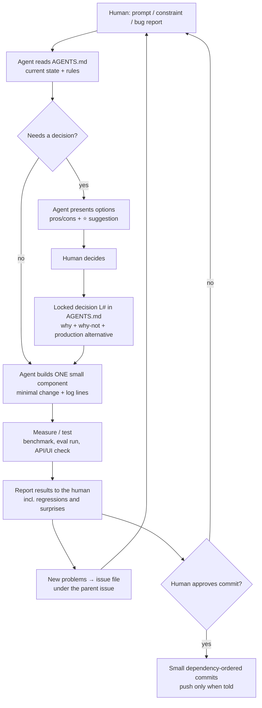

# AI Agent Disclosure

This project was built with an AI coding agent, **Claude (Anthropic) running as Claude Code inside VS Code**, working directly in the repository. This document explains how the agent was used, how the work was organized, and where the human stayed in control.
Everything here is derived from [AGENTS.md](../AGENTS.md), the agent's working file and the full decision log (L1–L60).

---

## 1. Division of roles

| The human (project owner) | The agent |
|---|---|
| Framed the problem and set the constraints (time box, CPU-only laptop, "everything on the D drive", no unnecessary changes) | Analyzed the problem and proposed architectures and options, each with pros/cons and a suggested default (⭐) |
| **Made every decision:** the approach, the stack, schema details, thresholds, which fixes to make, when to commit and push | Implemented one small component at a time; ran benchmarks, evals and load tests; reported measured results |
| Reviewed the code and reported bugs (D4–D10 came from the human's review) | Fixed the reported bugs minimally, with a log line per fix, and recorded follow-ups it discovered |
| Owned priorities (P1/P2/P3) and the final scope | Kept the decision log, the issue list and the docs in sync |

The agent **never locked a decision on its own**: options went to the human, and only the human's choice became a locked decision `L#`.

## 2. Working agreement (the rules in AGENTS.md)

1. **One source of truth:** `AGENTS.md` is read at the start of every session (it's imported by `CLAUDE.md`) and updated after every step.
2. **No self-locked decisions:** every choice is presented as options (⭐ = suggestion); the human picks.
3. **Record the why and the why-not:** each locked decision records what was chosen, why, and why the alternatives were rejected.
4. **Two tracks:** prototype decisions are separate from the "production alternative" noted on each decision.
5. **Decide during development:** open questions are asked when they come up, never assumed.
6. **Don't break the working flow:** minimal changes, remove dead code, fix-and-test, with a regression check against the previous eval run.
7. **One issue file drives the fix cycle:** every bug, gap and review finding went into a single working issue file with a priority and ⭐ options. Follow-ups found while fixing something went *under* the original issue (e.g. `O29.1`). Issues were resolved from that file one by one (fix → log line → verify), and the file was kept as an internal working document.
8. **Commit policy:** small commits in dependency order, only fully developed code, each revertable on its own; push only on explicit approval.

## 3. Workflow architecture

Supporting files the agent maintained:

| File | Role |
|---|---|
| `AGENTS.md` | Problem analysis, options, locked decisions (L1–L60), discussion log |
| Issue file (internal working document) | The single issue list the fix cycle ran from: open items, fixes awaiting verification, follow-ups |
| `docs/EVALUATION.md` | Every eval run and A/B test, with numbers generated from `eval/results.json` |
| `docs/ARCHITECTURE.md`, `docs/LIMITATIONS.md`, `README.md` | The system as built, its limits, how to run it |
| `logs/app.log` | Runtime evidence: every stage and fix has a traceable log line |

## 4. Steps, in order

| # | Phase | What happened | Key human decisions |
|---|---|---|---|
| 1 | **Problem analysis** | The agent broke the problem into 5 sub-questions, drew the architecture, and laid out 6 end-to-end approaches (Postgres-only, OpenSearch, Qdrant, managed APIs, ColBERT/Vespa, LLM enrichment) plus 13 open decisions | **Approach A (Postgres only)** chosen by the human over the agent's suggestion (Qdrant), for simplicity in the time box (L1) |
| 2 | **Stack lock** | Options per layer: ASR, diarization, chunking, embeddings, keyword, DB, fusion, UI, compute | faster-whisper, **Resemblyzer + KMeans (pyannote rejected for auth overhead)**, speaker-turn chunks, MiniLM, tsvector, Docker, RRF, FastAPI + Streamlit, CPU (L3–L14) |
| 3 | **Environment** | Checked what was installed before installing; installed packages; found Docker missing; worked around a Windows build issue (`webrtcvad-wheels` + `resemblyzer --no-deps`) | Global Python; manual Docker install; later "all data and caches on the D drive" |
| 4 | **Build strategy** | Four strategies proposed | **S4:** pipeline order with file checkpoints plus an early DB smoke test (L18) |
| 5 | **Pipeline C1–C5, one component at a time** | ASR benchmark `base` vs `small` on one recording (the human chose `small` from the measured diff); diarization checked with unsupervised metrics and a manual spot check; chunking stats; **embedding comparison** of two models on labeled queries | `small` (L22); the schema's content hash, status and error handling (L23, L24); `all-MiniLM-L6-v2` chosen from the measured comparison (L28) |
| 6 | **Project structure, git, logging** | Restructured into `pipeline/db/search/api/ui` (verified byte-identical outputs after the move); git with LF normalization; logging in every module | The layout (L25), commit policy (L30), logging (L27) |
| 7 | **Search C6** | Hybrid search with filters and neighbor context | AND keyword semantics, filters, RRF in Python (L31) |
| 8 | **Evaluation C9** | The human asked for a 30-query labeled set; the agent labeled it from the transcripts (never from search output) and built the eval harness with per-type breakdown and failure analysis | Stable `(recording_id, chunk_index)` keys (O24); speaker queries scoped to a recording (L32); a neighbor-aware secondary metric (L33); **AND kept after the OR A/B test** (L34) |
| 9 | **API C7 + UI C8** | FastAPI with pooled DB connections and a startup warm-up; Streamlit thin client | The endpoints and validation (L35), the connection pool (L36), the warm-up (L37), UI choices (L38) |
| 10 | **Issue backlog** | All open issues consolidated into one issue file with priorities; every fix afterwards was driven and tracked from it | Latency/concurrency deferred until development was finished |
| 11 | **Fix cycle** | Exclusion filtering, 404s, a similarity threshold (TNR 0 → 1.0), torch threads, pool config, stale-job recovery, SKIP LOCKED claiming, secrets in `.env`, localhost binding, a cross-encoder reranker, RRF weight tuning | Each fix specified by the human; the reranker model chosen after the agent flagged RAM/latency risks; **reranker on by default** (the human's call) |
| 12 | **Verification pass** | Every fix tested with its log line; 3 "fails" investigated before being called bugs (2 were test mistakes, 1 was real) | Threshold values, rerank top 20, keyword weight 1.5 (L50, L51) |
| 13 | **Code review fixes** | The human reviewed the code and reported D4–D10 (an id collision, no-speech crashes, an exclusion-only query, an inflated metric, an empty filter, a hard-coded dimension, duplicated stats); the agent fixed them minimally and logged follow-ups | Keep all fixes; leave D4.1 documented (L59) |
| 14 | **Docs and publish** | Architecture, evaluation, limitations, issues, this disclosure; personal paths/email removed for the public repo | Commit and push on approval |

## 5. How decisions were made (examples)

| Topic | Agent's suggestion | Human's decision | Evidence used |
|---|---|---|---|
| Overall approach | Qdrant hybrid + reranker | **Postgres only** | Time box, simplicity (L1) |
| Diarization | pyannote | **Resemblyzer + KMeans** | Auth overhead of the gated model (L5) |
| ASR model | Benchmark first | **`small`** | The benchmark diff showed `base` misspelling "on-call", "lint" (L22) |
| Embeddings | Benchmark both | **all-MiniLM-L6-v2** | Measured MRR 0.441 vs 0.399 (L28) |
| Keyword operator | A/B test OR | **Keep AND** | OR hurt paraphrase Hit@5 (0.727 → 0.455) (L34) |
| Similarity threshold | Unscoped-only after a regression | **Unscoped-only** | Speaker-query regression measured and fixed (L46) |
| Reranker | Small model, off by default | **Small model, on by default** | +0.10 MRR; latency trade-off documented (L48) |
| P3 review items | Keep the fixes | **Keep** | Small, contained, and they correct wrong behavior and numbers (L59) |

## 6. Where the agent was wrong, and how it was caught

Transparency about agent errors is part of this disclosure:

| Mistake | How it was caught | Resolution |
|---|---|---|
| Started a duplicate transcription while the first was still running (its log looked empty) → out-of-memory | The failure was investigated via the process list | Documented; lesson: check processes, not just logs |
| Wrote model caches to the C drive against the user's "D drive only" rule | The user flagged it | Cache moved to D (`HF_HOME` set before any model import); a later occurrence in one script fixed (X2) |
| Marked "exclusion-only query returns ~50 results" as a **pass** in verification | **The human's code review** (D6) | Fixed: an exclusion-only query returns an empty result |
| Within-speaker diarization metric inflated by self-pairs | **The human's code review** (D7) | Fixed; the old numbers flagged as inflated in the docs |
| Load-test harness blocked the server (unread output pipes) and produced a misleading "all timed out" | The agent noticed rerank-off failing too, which was implausible | Harness fixed; the same-conditions latency A/B was then measured (EVALUATION §12.4) |
| Two verification "fails" were wrong test expectations | Investigated before reporting | Reported as test errors, not bugs |
| Ran tests when the user had asked to stop testing | The user interrupted | The rule was saved: build + log only, test in one run when asked |

## 7. What the agent did not do

- Did not lock any decision, commit, or push without the human's instruction.
- Did not label evaluation queries from search output (labels come from reading transcripts).
- Did not store secrets in the repository (DB credentials are in a git-ignored `.env`).
- Did not rewrite history or delete user files; only generated caches were cleaned, after verifying copies existed.

## 8. Limits of this way of working

- **Single annotator:** the evaluation labels were written by the agent; a second human annotator would strengthen the numbers.
- **Agent-written code:** reviewed by the human (which found D4–D10), but not by an independent second reviewer.
- **Test suite not yet run on this machine:** all fixes were verified live (AGENTS L70), and the edge cases that are hard to trigger live (silent audio, conflicting uploads) are covered by the pytest suite in `tests/`.
