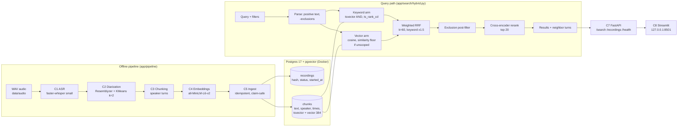
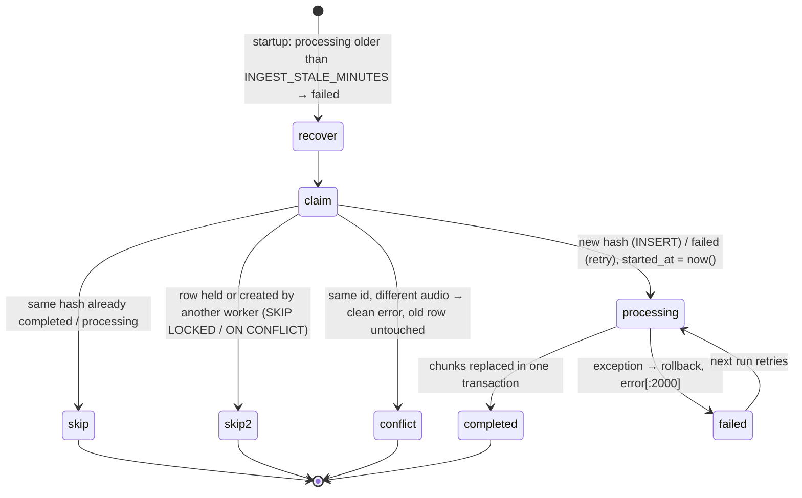

# Architecture

Hybrid (keyword + semantic) retrieval over two-speaker conversation recordings.
This document describes the system as built for the time-boxed prototype, and how it would scale to production.
The reasoning behind each choice (and the options that were rejected) is recorded in [AGENTS.md](../AGENTS.md) as decisions `L1`–`L60`.

> **Build status:** all components (C1–C9) are built and verified end to end (AGENTS L50, L51, L70): the regression eval matches the previous run exactly, the diarization re-run reproduces identical speaker labels, and the robustness fixes were checked live with their log lines. Test suite: `tests/` (see README).

---

## 1. Goals and constraints

| | |
|---|---|
| **Goal** | Find the exact moment in any recording where something was said, by keyword or by meaning, and know **who** said it. |
| **Data** | 6 recordings, mono, 22.05 kHz, 16-bit WAV, 8–9.5 min each (~52 min total), 2 speakers per recording. |
| **Scale (prototype)** | 344 chunks. |
| **Hardware** | Windows 10, 7.9 GB RAM, **CPU only** (no GPU). |
| **Build window** | Short and time-boxed, so simplicity and explainability beat maximum quality. |

## 2. System overview



The design follows **Approach A: a single Postgres database** holds metadata, full-text search and vector search.
At this scale one transactional database keeps the system simple, fully explainable and fast to build, with no extra infrastructure to run (`L1`).

## 3. Offline pipeline

Each stage reads the previous stage's file output and writes its own under `data/processed/<stage>/` (`L20`).
Stages can be re-run independently (slow ASR runs once), and every intermediate result can be inspected. The JSON outputs are committed; the `.npz` embeddings are git-ignored and regenerated in seconds (`L45`).

| Stage | Module | Input | Output | Key choice |
|---|---|---|---|---|
| **C1 ASR** | `app/pipeline/asr.py` | `data/audio/<rec>.wav` | `asr/<rec>.small.json`: segments `{id, start, end, text}` | faster-whisper `small`, int8, CPU, `language="en"` (`L4`, `L22`) |
| **C2 Diarization** | `app/pipeline/diarize.py` | ASR JSON + WAV | `diarization/<rec>.json`: segments + `speaker` (`A`/`B`) + diagnostics | Resemblyzer voice embedding per ASR segment → KMeans(k=2) (`L5`) |
| **C3 Chunking** | `app/pipeline/chunk.py` | diarization JSON | `chunks/<rec>.json`: `{chunk_index, speaker, start, end, text, segment_ids}` | Merge same-speaker segments if gap ≤ 1 s and chunk ≤ 30 s (`L6`) |
| **C4 Embeddings** | `app/pipeline/embed.py` | chunks JSON | `embeddings/<model>/<rec>.npz` (n×384, L2-normalized) | `all-MiniLM-L6-v2`, chosen by measured comparison (`L28`) |
| **C5 Ingest** | `app/pipeline/ingest.py` | WAV (hash) + chunks + embeddings | rows in Postgres | Content-hash idempotency, status tracking, safe claiming (`L23`, `L24`, `L43`, `L49`, `L52`) |

### 3.1 C1: Speech-to-text
- faster-whisper (CTranslate2) with int8 weights on CPU; segments carry start/end timestamps.
- `small` was chosen over `base` after a benchmark: it correctly transcribed keyword-critical terms ("on-call", "lint", "write-up", "2.20").
- A recording with no speech is valid: an empty segment list, plus a warning instead of stats (`L53`).

### 3.2 C2: Diarization (who spoke)
1. Load audio at 16 kHz (librosa), with no silence trimming, so timestamps stay exact.
2. For each ASR segment, compute a 256-d Resemblyzer speaker embedding.
3. Cluster the recording's segment embeddings with KMeans(k=2) (every recording has two speakers).
4. Name clusters by order of appearance: the **first voice heard is always `A`**.
5. Fewer than 2 segments (silent / one utterance): clustering is skipped, everything is labeled `A`, and the file is marked `single_speaker: true` (`L60`).

Diagnostics per recording: silhouette, within-speaker cosine (distinct pairs only, `L55`), between-speaker cosine. Metrics that are undefined are `null`, never an exception.

### 3.3 C3: Chunking
A chunk is **one speaker turn**: consecutive segments from the same speaker, merged while the gap is ≤ 1 s and the chunk stays ≤ 30 s.
- Every chunk has exactly one speaker, so speaker filtering is exact.
- 30 s of speech stays well inside MiniLM's 256-token input (the longest chunk is 45 words).
- Trade-off: a question and its answer land in neighboring chunks, so results include the previous and next turn.

### 3.4 C4: Embeddings
- `sentence-transformers` `all-MiniLM-L6-v2` (384-d), `normalize_embeddings=True`, so pgvector cosine distance (`<=>`) is correct.
- The embedder sees chunk text only; the speaker is a column, not embedded.

### 3.5 C5: Ingest (idempotent, safe for parallel workers)



- **Idempotency key:** SHA-256 of the audio bytes (`content_sha256 UNIQUE`); the same audio is never loaded twice, even under another file name.
- **Stale recovery (K1):** at startup, recordings stuck in `processing` beyond `INGEST_STALE_MINUTES` (default 30) become `failed` and are retried.
- **Claiming (K2):** `SELECT … FOR UPDATE SKIP LOCKED` for existing rows; `INSERT … ON CONFLICT DO NOTHING` (covers both the hash and the `id` key) for new ones. Every claim commits immediately.
- **ID conflict (D4):** the same file name with different audio → one clean error line; the stored recording is not touched.
- **Checks before writing:** embedding `chunk_index` order must match the chunk file; the embedding width must equal the DB column dimension (D9).
- **Log-and-continue (O22):** a failing recording is logged and counted; the run continues; the summary lists failures; exit code 1 if any failed.

## 4. Data model

```sql
recordings (
  id              TEXT PRIMARY KEY,          -- file stem, e.g. rec01_standup_incident
  file_path       TEXT NOT NULL,
  content_sha256  TEXT NOT NULL UNIQUE,      -- idempotency key
  duration_s      REAL NOT NULL,
  status          TEXT NOT NULL CHECK (status IN ('processing','completed','failed')),
  error           TEXT,                      -- truncated to 2000 chars by the app
  created_at, updated_at TIMESTAMPTZ,
  started_at      TIMESTAMPTZ                -- set when a worker claims it (stale detection)
)

chunks (
  id            BIGSERIAL PRIMARY KEY,       -- internal only; changes on re-ingest
  recording_id  TEXT REFERENCES recordings(id) ON DELETE CASCADE,
  chunk_index   INT,                         -- stable external key with recording_id
  speaker       TEXT,                        -- 'A' | 'B' (per recording)
  start_s, end_s REAL,                       -- timestamps for audio playback
  text          TEXT,
  tsv           TSVECTOR GENERATED ALWAYS AS (to_tsvector('english', text)) STORED,
  embedding     VECTOR(384),                 -- must match EMBED_MODEL (checked at ingest/API startup)
  UNIQUE (recording_id, chunk_index)
)
-- GIN index on tsv. No vector index: exact scan (100% recall) at this scale.
```

Full DDL: [`app/db/schema.sql`](../app/db/schema.sql) (includes `ALTER TABLE … ADD COLUMN IF NOT EXISTS started_at` for older databases).

## 5. Query path (`app/search/hybrid.py`)

1. **Validate:** a speaker filter requires a recording filter (`A`/`B` are per recording, `L32`).
2. **Parse:** exclusions (`-word`, `-"phrase"`) are separated from the positive text. **Only exclusions → empty result** (`D6`). The embedder sees only the positive text (`O29.1`).
3. **Keyword arm:** `websearch_to_tsquery('english', q)` (AND of terms, phrases, exclusions), ranked by `ts_rank_cd`, top 50. AND was kept over OR after an A/B test (`L34`).
4. **Vector arm:** cosine scan, top 50. **Similarity floor 0.3 for unscoped searches** (0.45 for queries without letters) keeps gibberish/off-topic queries empty; **recording-scoped searches skip the floor**, because weakly-worded but correct turns score low (`L41`, `L46`, `L51`).
5. **Weighted RRF:** `score(d) = Σ w_arm / (60 + rank_arm(d))`, keyword weight 1.5, vector 1.0 (`L48`, `L51`).
6. **Exclusion post-filter:** drops any fused chunk matching an excluded word prefix (`\bterm`), from either arm, before the top-N (`L39`, `L47`).
7. **Rerank:** cross-encoder `ms-marco-MiniLM-L-6-v2` reorders the top 20 fused candidates (reads query + turn together); `RERANK=0` disables it (`L48`, `L51`).
8. **Return** the top N with speaker, `start_s`/`end_s`, recording and the previous/next turn. Nothing matches → an explicit empty list.

## 6. Serving (`app/api/main.py`, `app/ui/streamlit_app.py`)

| Piece | Behavior |
|---|---|
| **Endpoints** | `GET /search?q=&recording=&speaker=&n=`, `GET /recordings`, `GET /health` (GET + query params; the search config is fixed, `L35`) |
| **Validation** | `q` 1–500 chars; `recording` non-empty (`D8`); `speaker ∈ {A,B}` requires `recording` (422); unknown recording → 404 (`L40`); DB down → 503. 422s are logged |
| **DB access** | One `psycopg_pool` per process (sized by `DB_POOL_SIZE` + `DB_POOL_MAX_OVERFLOW`), opened at startup; a `get_db()` dependency per request (`L36`, `L42`) |
| **Startup** | Load the embedder (torch threads = `TORCH_NUM_THREADS`), check the embedding dimension against the DB (refuse to start on a mismatch, `D9`), run a warm-up search, load and run the reranker once (`L37`, `L51`) |
| **UI** | Thin client of the API; recording/speaker filters (speaker enabled only with a recording), results with context turns and audio from the turn start; "No matches" for empty results; a 404 shows the API message and refreshes the recording list. Bound to `127.0.0.1` via `.streamlit/config.toml` (`L38`, `L44`) |

## 7. Cross-cutting concerns

| Concern | Implementation |
|---|---|
| **Logging** | `app/log.py`: console + `logs/app.log` (rotating 5 MB × 3), `time LEVEL [module] message`. Every fix has a traceable log line (e.g. `claim <rec>: …`, `vector_hits(threshold=…)`, `rerank=on(N)`). The password is never logged. |
| **Configuration** | `app/config.py` + git-ignored `.env` (`.env.example` committed): `POSTGRES_*`, `DB_POOL_SIZE`, `DB_POOL_MAX_OVERFLOW`, `TORCH_NUM_THREADS`, `INGEST_STALE_MINUTES`, `RRF_K`, `RRF_KEYWORD_WEIGHT`, `RERANK`, `RERANK_MODEL`, `RERANK_TOP` |
| **Model cache** | `app/__init__.py` sets `HF_HOME` to `.local/huggingface` (project drive), before any model library is imported |
| **Reproducibility** | `requirements.txt`, `docker-compose.yml`, deterministic KMeans (`random_state=0`), committed per-stage JSON, `eval/run_eval.py` with flags (`--rerank`, `--rrf-k`, `--kw-weight`, `--min-vector-sim`) |
| **Resources** | 8 GB machine: run the API/UI and the eval/ingest jobs one at a time (README) |

## 8. Technology choices

| Layer | Choice | Main reason | Rejected alternatives |
|---|---|---|---|
| Storage + search | Postgres 17 + pgvector (Docker) | One DB for metadata, full-text and vectors | OpenSearch (heavy ops), Qdrant (weaker keyword search, second store), managed APIs (cost, privacy) |
| ASR | faster-whisper `small` int8 | Accurate on CPU; clean Windows install | WhisperX (heavier), NeMo (GPU/Windows pain), `base` (misses domain terms) |
| Diarization | Resemblyzer + KMeans(k=2) | No auth tokens, CPU-fast, exactly 2 speakers | pyannote (gated model), NeMo (heavy) |
| Embeddings | all-MiniLM-L6-v2 | Won the measured comparison; small and fast | multi-qa-MiniLM (lower MRR), BGE-M3 / Qwen3 (too slow on CPU) |
| Keyword | tsvector + GIN + `ts_rank_cd`, AND mode | Built in, no extension; AND beat OR in hybrid | ParadeDB BM25 (extra image), SPLADE (extra model), OR mode (hurt paraphrase recall) |
| Fusion | Weighted RRF (k=60, keyword 1.5) | Scale-independent; the weight fixed demoted exact matches | Score normalization (needs tuning data) |
| Reranker | ms-marco-MiniLM-L-6-v2 cross-encoder, top 20 | +0.10 MRR on CPU at ~90 MB | bge-reranker-v2-m3 (2.2 GB, RAM/latency on this machine) |
| API / UI | FastAPI + Streamlit | All Python, fast to build | React/Next.js (time) |

## 9. Scaling to production

| Pressure | Change |
|---|---|
| > ~100k–1M chunks | pgvector **HNSW** index (`vector_cosine_ops`), `halfvec`/int8 to cut memory |
| > ~10–50M chunks or high QPS | Move retrieval to Qdrant/OpenSearch, or shard Postgres with Citus; Postgres stays the system of record |
| Rerank latency under load | GPU or a dedicated reranker service; batch concurrent requests; tune `RERANK_TOP` |
| Keyword quality | True BM25 (ParadeDB `pg_search` / OpenSearch), fuzzy or phonetic matching for names ASR misspells |
| ASR / diarization | GPU workers (WhisperX / Parakeet), pyannote / NeMo Sortformer (overlap, in-segment speaker changes), channel split for stereo call audio, role labeling |
| Ingestion throughput | Job queue with a `pending` state, heartbeat-refreshed leases, many workers (SKIP LOCKED claiming already in place) |
| Chunking | Multi-turn windows / parent–child chunks with a contextual header |
| Ops | Managed Postgres, secrets manager, auth + rate limits, JSON logs to a central store, per-stage metrics |

See [LIMITATIONS.md](LIMITATIONS.md) for the prototype's known limits and [EVALUATION.md](EVALUATION.md) for measured quality.
