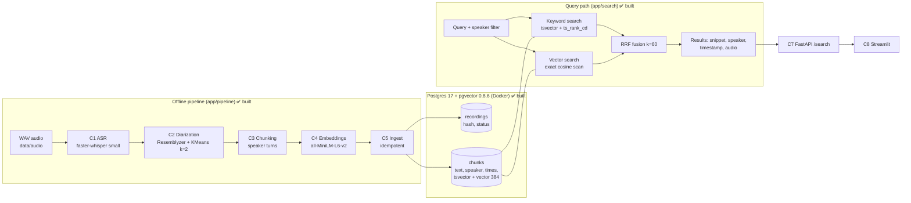
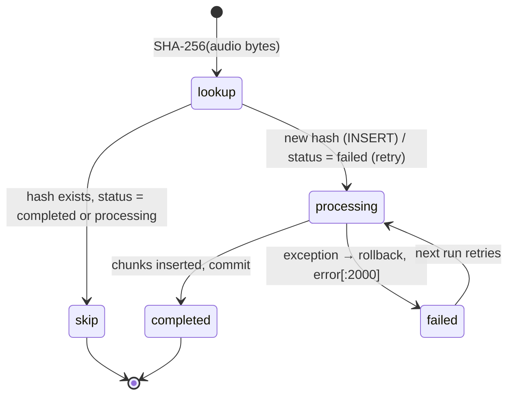

# Architecture

Hybrid (keyword + semantic) retrieval over two-speaker conversation recordings.
This document describes the system as built for the time-boxed prototype, and how it would scale to production.
The reasoning behind each choice (and the options that were rejected) is recorded in [AGENTS.md](../AGENTS.md) as decisions `L1`–`L30`.

> **Build status:** the offline pipeline (C1–C5), the database, hybrid search (C6) and the evaluation (C9) are built and tested. The API (C7) and UI (C8) are *planned*.

---

## 1. Goals and constraints

| | |
|---|---|
| **Goal** | Find the exact moment in any recording where something was said, by keyword or by meaning, and know **who** said it. |
| **Data** | 6 recordings, mono, 22.05 kHz, 16-bit WAV, 8–9.5 min each (~52 min total), 2 speakers per recording. |
| **Scale (prototype)** | 344 chunks. |
| **Hardware** | Windows 10, 7.9 GB RAM, **CPU only** (no GPU). |
| **Build window** | Short and time-boxed, so simplicity and explainability beat maximum quality. |

## 2. System overview



The design follows **Approach A: a single Postgres database** holds metadata, full-text search and vector search.
At this scale one transactional database keeps the system simple, fully explainable and fast to build, with no extra infrastructure to run (`L1`).

## 3. Offline pipeline

Each stage reads the previous stage's file output and writes its own under `data/processed/<stage>/` (`L20`).
Stages can be re-run independently (slow ASR runs once), and every intermediate result can be inspected.

| Stage | Module | Input | Output | Key choice |
|---|---|---|---|---|
| **C1 ASR** | `app/pipeline/asr.py` | `data/audio/<rec>.wav` | `asr/<rec>.small.json`: segments `{id, start, end, text}` | faster-whisper `small`, int8, CPU, `language="en"` (`L4`, `L22`) |
| **C2 Diarization** | `app/pipeline/diarize.py` | ASR JSON + WAV | `diarization/<rec>.json`: segments plus `speaker` (`A`/`B`) and quality diagnostics | Resemblyzer voice embedding per ASR segment → KMeans(k=2) (`L5`) |
| **C3 Chunking** | `app/pipeline/chunk.py` | diarization JSON | `chunks/<rec>.json`: `{chunk_index, speaker, start, end, text, segment_ids}` | Merge consecutive same-speaker segments if gap ≤ 1 s and chunk ≤ 30 s (`L6`) |
| **C4 Embeddings** | `app/pipeline/embed.py` | chunks JSON | `embeddings/<model>/<rec>.npz`: `vectors` (n×384, L2-normalized), `chunk_index` | `all-MiniLM-L6-v2`, chosen by measured comparison (`L28`) |
| **C5 Ingest** | `app/pipeline/ingest.py` | WAV (hash) + chunks + embeddings | rows in Postgres | Content-hash idempotency and status tracking (`L23`, `L24`) |

### 3.1 C1: Speech-to-text
- faster-whisper (CTranslate2) with int8 weights on CPU. The model produces segments with start/end timestamps.
- `small` was chosen over `base` after a benchmark on one recording: `small` correctly transcribed domain words that keyword search depends on ("on-call", "lint", "write-up", "2.20"), which `base` got wrong.

### 3.2 C2: Diarization (who spoke)
1. Load audio at 16 kHz (librosa), with no silence trimming, so timestamps stay exact.
2. For each ASR segment, slice the audio and compute a 256-d Resemblyzer speaker embedding.
3. Cluster all segment embeddings of the recording with KMeans(k=2), since every recording has exactly two speakers.
4. Name clusters by order of appearance: the **first voice heard is always `A`**.

This reuses ASR segment boundaries instead of running a separate segmentation model. It needs no model access tokens (pyannote was rejected for its gated-model setup overhead) and runs on CPU in seconds.

### 3.3 C3: Chunking
A chunk is **one speaker turn**: consecutive segments from the same speaker, merged while the gap is ≤ 1 s and the chunk stays ≤ 30 s.
- Every chunk has exactly one speaker, so speaker filtering is exact.
- 30 s of speech stays well inside MiniLM's 256-token input limit (the longest chunk is 45 words).
- Trade-off: a question and its answer land in neighboring chunks. `chunk_index` preserves order, so neighbors can be shown together.

### 3.4 C4: Embeddings
- `sentence-transformers` with `all-MiniLM-L6-v2` (384-d), `normalize_embeddings=True`, so cosine distance in pgvector (`<=>`) is correct.
- The embedder sees **chunk text only**; the speaker label is stored as a column, not embedded.

### 3.5 C5: Ingest (idempotent)



- **Idempotency key:** the SHA-256 of the audio bytes (`content_sha256 UNIQUE`). The same audio is never loaded twice, even under a different file name.
- **Status:** `processing` → `completed` | `failed`; `updated_at` is refreshed on every change.
- **Failure record:** the traceback, truncated to 2000 characters, goes into `recordings.error` and the full traceback into the log.
- **Safety check:** loading aborts if the embedding `chunk_index` order does not match the chunk file.
- Chunks are replaced as a whole inside one transaction (`DELETE` + `INSERT`), so a retry never duplicates rows.

## 4. Data model

```sql
recordings (
  id              TEXT PRIMARY KEY,          -- file stem, e.g. rec01_standup_incident
  file_path       TEXT NOT NULL,
  content_sha256  TEXT NOT NULL UNIQUE,      -- idempotency key
  duration_s      REAL NOT NULL,
  status          TEXT NOT NULL CHECK (status IN ('processing','completed','failed')),
  error           TEXT,                      -- truncated to 2000 chars by the app
  created_at, updated_at TIMESTAMPTZ
)

chunks (
  id            BIGSERIAL PRIMARY KEY,
  recording_id  TEXT REFERENCES recordings(id) ON DELETE CASCADE,
  chunk_index   INT,                         -- order within the recording
  speaker       TEXT,                        -- 'A' | 'B'
  start_s, end_s REAL,                       -- timestamps for audio playback
  text          TEXT,
  tsv           TSVECTOR GENERATED ALWAYS AS (to_tsvector('english', text)) STORED,
  embedding     VECTOR(384),
  UNIQUE (recording_id, chunk_index)
)
-- GIN index on tsv. No vector index: exact scan (100% recall) at this scale.
```

Full DDL: [`app/db/schema.sql`](../app/db/schema.sql).

- **`english` text-search configuration:** stemming ("refunds" matches "refund") and stop-word removal. Hyphenated words are indexed both whole and split ("on-call" → `on-cal`, `call`).
- **No ANN index:** at 344 rows a brute-force cosine scan is exact and effectively instant (`L11`).

## 5. Query path (C6 ✅ `app/search/hybrid.py`; API/UI planned)

1. **Keyword arm:** `websearch_to_tsquery('english', q)` against `tsv` (AND of terms, `"phrases"`, `-exclude`), ranked by `ts_rank_cd`, top K = 50. An OR variant exists (`keyword_op="or"`), but AND was kept after the A/B test ([EVALUATION.md](EVALUATION.md)).
2. **Vector arm:** embed the query with the same MiniLM model, `ORDER BY embedding <=> q_vec`, top K = 50.
3. Apply the same **speaker / recording filters** to both arms. A speaker filter **requires** a recording filter, because `A`/`B` labels are per recording.
4. **Fuse with Reciprocal Rank Fusion:** `score(d) = Σ 1 / (60 + rank_i(d))` over the arms where `d` appears. RRF uses ranks, not scores, so the arms' incompatible scales (`ts_rank_cd` vs cosine) don't matter and there's no weight to tune (`L12`).
5. Return snippet, speaker, `start_s`/`end_s`, recording and neighboring turns. The UI plays the audio from `start_s`.

No reranker in the prototype: cross-encoders are slow on CPU and the time box doesn't allow them.

## 6. Cross-cutting concerns

| Concern | Implementation |
|---|---|
| **Logging** | `app/log.py`: every module logs to the console and to `logs/app.log` (rotating 5 MB × 3) as `time LEVEL [module] message`. Failures log the recording name and full traceback. The DB URL (password) is never logged. |
| **Configuration** | `app/config.py`: paths, `DATABASE_URL` (env override), `ASR_MODEL`, `EMBED_MODEL`. |
| **Model cache** | `app/__init__.py` sets `HF_HOME` to `.local/huggingface`, so model downloads stay inside the project folder. |
| **Reproducibility** | `requirements.txt`, `docker-compose.yml`, deterministic KMeans (`random_state=0`), per-stage files in `data/processed/`. |

## 7. Technology choices

| Layer | Choice | Main reason | Rejected alternatives |
|---|---|---|---|
| Storage + search | Postgres 17 + pgvector (Docker) | One DB for metadata, full-text and vectors | OpenSearch (heavy ops), Qdrant (weaker keyword search, second store), managed APIs (cost, privacy) |
| ASR | faster-whisper `small` int8 | Accurate on CPU; clean Windows install | WhisperX (heavier), NeMo (GPU/Windows pain), `base` (misses domain terms) |
| Diarization | Resemblyzer + KMeans(k=2) | No auth tokens, CPU-fast, exactly 2 speakers | pyannote (gated model), NeMo (heavy) |
| Embeddings | all-MiniLM-L6-v2 | Won the measured comparison; small and fast | multi-qa-MiniLM (lower MRR), BGE-M3 / Qwen3 (too slow on CPU) |
| Keyword | tsvector + GIN + `ts_rank_cd` | Built in, no extension | ParadeDB BM25 (extra image), SPLADE (extra model) |
| Fusion | RRF (k=60) | Parameter-free, scale-independent | Weighted fusion (needs tuning data) |
| API / UI | FastAPI + Streamlit | All Python, fast to build | React/Next.js (time) |

## 8. Scaling to production

| Pressure | Change |
|---|---|
| > ~100k–1M chunks | pgvector **HNSW** index (`vector_cosine_ops`), `halfvec`/int8 to cut memory |
| > ~10–50M chunks or high QPS | Move retrieval to Qdrant/OpenSearch, or shard Postgres with Citus. Postgres stays the system of record. |
| Keyword quality | True BM25 (ParadeDB `pg_search` / OpenSearch), fuzzy or phonetic matching for names ASR misspells |
| Ranking quality | Cross-encoder reranker over the fused top 50; weights tuned on a golden set |
| ASR / diarization | GPU workers with WhisperX or Parakeet, and pyannote / NeMo Sortformer (handles overlap and speaker changes inside a segment); channel split for stereo call audio |
| Ingestion throughput | Job queue with `pending` state, lease/heartbeat on `processing`, `SELECT … FOR UPDATE SKIP LOCKED` for parallel workers |
| Chunking | Multi-turn windows / parent–child chunks with a contextual header |
| Ops | Managed Postgres, JSON logs shipped to a central store, per-stage latency and error metrics |

See [LIMITATIONS.md](LIMITATIONS.md) for the prototype's known limits, and [EVALUATION.md](EVALUATION.md) for how quality is measured.
